# VulnTrack

A vulnerability and asset tracking web application built as a classic Java
3-tier stack — Jakarta EE on WildFly (JBoss), PostgreSQL, and a Dockerized
build/deploy pipeline, provisioned on AWS via Terraform and deployed
automatically through a GitHub Actions CI/CD pipeline using OIDC (no stored
cloud credentials). Built as a portfolio project to demonstrate full-stack
Java development, application-server administration, infrastructure as
code, and applied security (JWT auth, bcrypt hashing, role-based access
control) in one connected system.

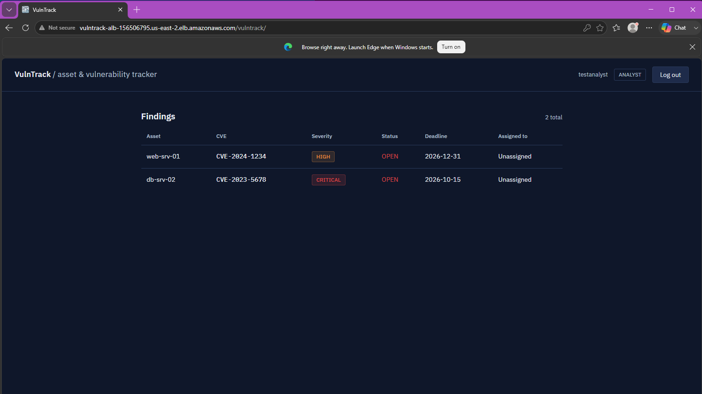
*The findings dashboard, running on real AWS infrastructure — WildFly on
ECS Fargate, PostgreSQL on RDS, behind an Application Load Balancer,
deployed automatically by GitHub Actions.*

---

## Table of contents

- [Architecture](#architecture)
- [Tech stack](#tech-stack)
- [Building it: from a failed archetype to a working REST API](#building-it-from-a-failed-archetype-to-a-working-rest-api)
- [Data model](#data-model)
- [API reference](#api-reference)
- [Authentication & authorization](#authentication--authorization)
- [Infrastructure as code](#infrastructure-as-code)
- [CI/CD pipeline](#cicd-pipeline)
- [Local development setup](#local-development-setup)
- [Troubleshooting log & lessons learned](#troubleshooting-log--lessons-learned)
- [Roadmap](#roadmap)

---

## Architecture

Classic 3-tier design:

- **Presentation tier**: a lightweight static frontend (vanilla HTML/JS,
  no build step) plus a REST API, both served from the same WildFly
  deployment
- **Application tier**: Jakarta EE (JAX-RS + CDI) on WildFly, containerized
  via a custom Docker image
- **Data tier**: PostgreSQL, with a hand-installed WildFly datasource
  module rather than the default H2 example

```
 Browser (dashboard) ──┐
                        ├──> ALB ──> WildFly (JAX-RS, CDI, JWT filter) ──> PostgreSQL (RDS)
 curl / API clients ───┘
```

Locally this runs via Docker Compose. In production it runs on AWS: ECS
Fargate + RDS + an Application Load Balancer, all provisioned by Terraform.

See [`docs/diagrams/vulntrack-er-diagram.md`](docs/diagrams/vulntrack-er-diagram.md)
for the full entity-relationship diagram (renders automatically on GitHub).

---

## Tech stack

| Layer | Technology |
|---|---|
| Application server | WildFly 31 (JBoss) |
| Language / runtime | Java 17 (Eclipse Temurin) |
| Web framework | Jakarta EE 10 (JAX-RS, CDI) |
| ORM | Hibernate 6 / Jakarta Persistence |
| Database | PostgreSQL 16 |
| Auth | JWT (jjwt) + bcrypt (jBCrypt) |
| Frontend | Vanilla HTML/CSS/JS, no framework or build step |
| Build | Maven |
| Containerization | Docker, Docker Compose |
| Infrastructure | Terraform (VPC, RDS, ECS Fargate, ALB, Secrets Manager) |
| CI/CD | GitHub Actions, OIDC-authenticated (no stored AWS credentials) |

---

## Building it: from a failed archetype to a working REST API

The Maven archetype plugin failed outright on the very first command, so
the project was scaffolded by hand instead — writing `pom.xml` and the
folder structure directly rather than relying on generated templates.

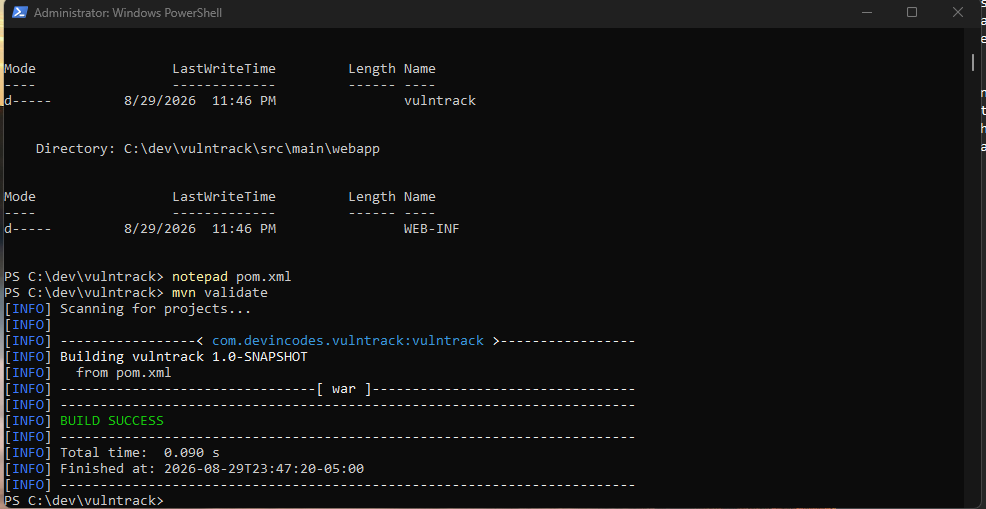
*The first clean `mvn validate` after hand-writing the Maven configuration*

That led to the first real milestone: WildFly running in Docker, serving a
REST endpoint end to end.

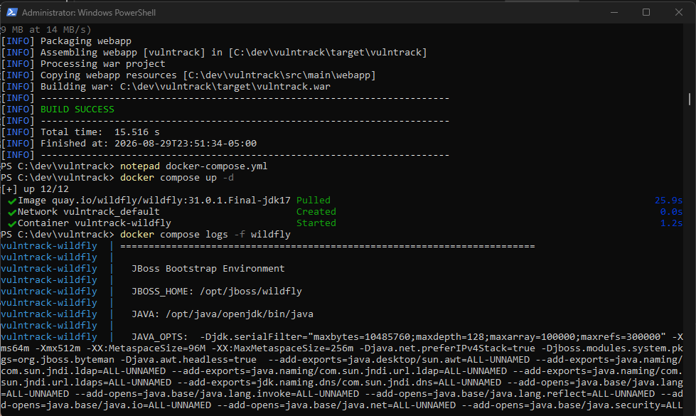

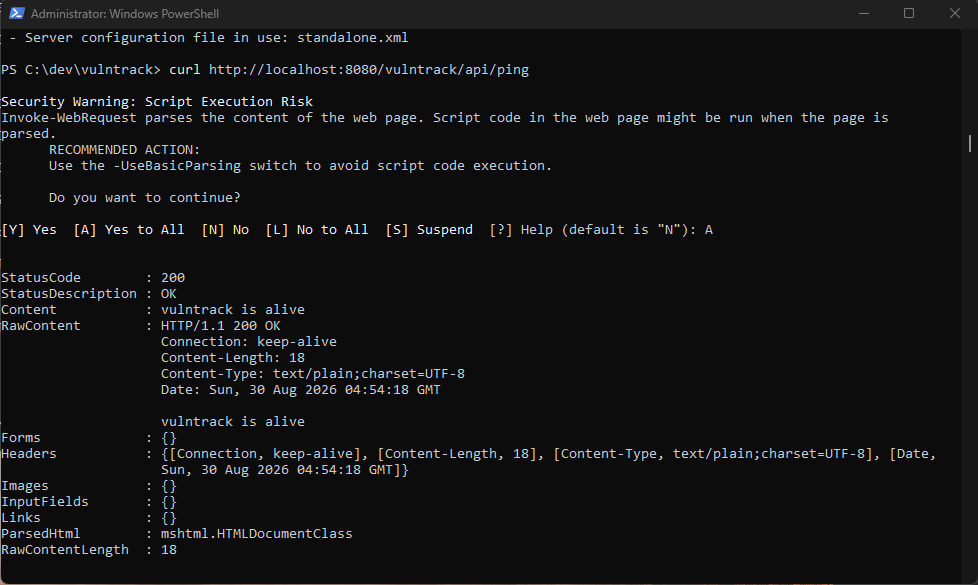
*Maven → WAR → WildFly → REST, working end to end for the first time*

---

## Data model

Four core entities: `Asset`, `Vulnerability`, `Finding` (the join entity
linking a vulnerability to an asset with a status and remediation
deadline), and `AppUser`.

PostgreSQL runs as its own container with a **hand-installed JDBC driver
module** — WildFly doesn't ship one — configured via a CLI script that
runs during the Docker image build:

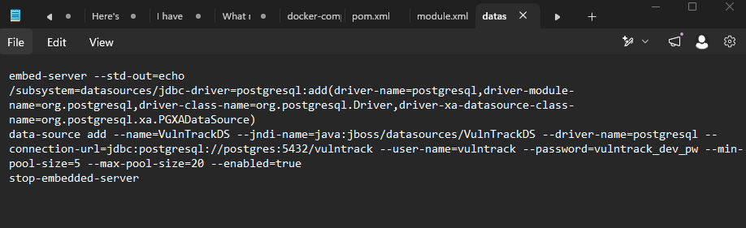
*Registers the PostgreSQL driver and creates the `VulnTrackDS` datasource,
using `${env.VAR:default}` expressions so the same image works unchanged
in both local Docker Compose and AWS*

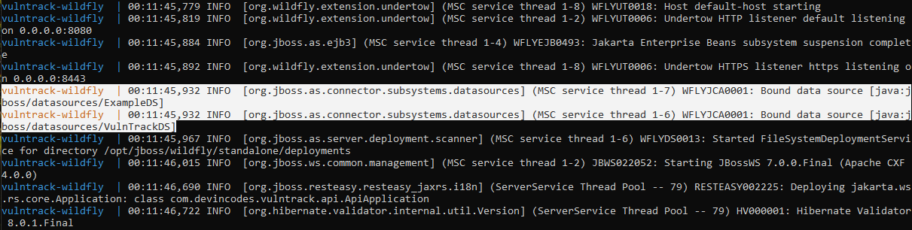
*WildFly's default `ExampleDS` alongside the custom `VulnTrackDS`*

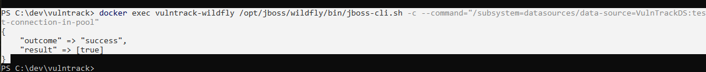
*Confirming the datasource can actually reach Postgres, not just that it's registered*

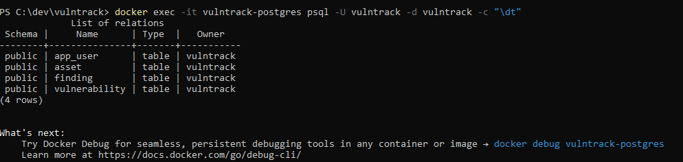
*Hibernate mapped all four JPA entities to real Postgres tables*

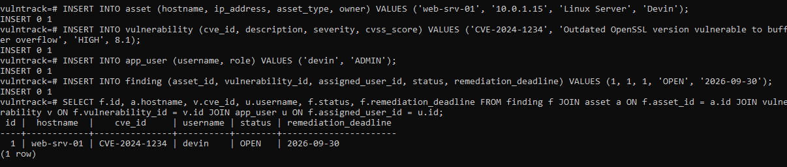
*A single SQL join across all four tables — the clearest proof the
relational model is correct, not just that the tables exist*

---

## API reference

Base path: `/vulntrack/api`

| Method | Endpoint | Auth required | Notes |
|---|---|---|---|
| POST | `/auth/register` | No | Creates a user (bcrypt-hashed password) |
| POST | `/auth/login` | No | Returns a signed JWT (1-hour expiry) |
| GET | `/assets` | Yes | List all assets |
| GET | `/assets/{id}` | Yes | Get one asset |
| POST | `/assets` | Yes | Create an asset |
| PUT | `/assets/{id}` | Yes | Update an asset |
| DELETE | `/assets/{id}` | Yes (**ADMIN only**) | Delete an asset |
| GET / POST / PUT / DELETE | `/vulnerabilities`, `/vulnerabilities/{id}` | Yes | Same CRUD pattern |
| GET / POST / PUT / DELETE | `/users`, `/users/{id}` | Yes | Same CRUD pattern |
| GET / POST / PUT / DELETE | `/findings`, `/findings/{id}` | Yes | Accepts `assetId` / `vulnerabilityId` / `assignedUserId` in the request body; the server resolves the actual entities |

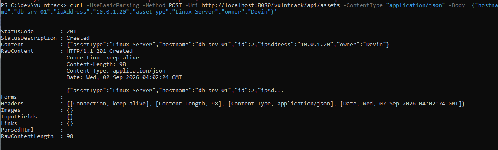
*`201 Created` confirming the full write path — REST → JPA → Postgres*

---

## Authentication & authorization

- Passwords are hashed with bcrypt before storage — never stored plain
- `POST /auth/login` returns a JWT signed with HS384, containing the
  username (`sub`) and role (`role`) claims
- A `ContainerRequestFilter` (`AuthFilter`) validates the
  `Authorization: Bearer <token>` header on every request except
  `/auth/*` and the health-check endpoint `/ping`
- Role checks are enforced per-endpoint using a `@RequestScoped` CDI bean
  (`RequestUserContext`) shared between the filter and the resource
  classes — a CDI-proxied JAX-RS resource can't reliably inject
  `ContainerRequestContext` directly, so this bean bridges the filter and
  the resource cleanly (see [Troubleshooting log](#troubleshooting-log--lessons-learned))
- Example: `DELETE /assets/{id}` is restricted to `ADMIN`; `ANALYST` users
  get `403 Forbidden`

Verified against the **live AWS deployment**, not just locally:

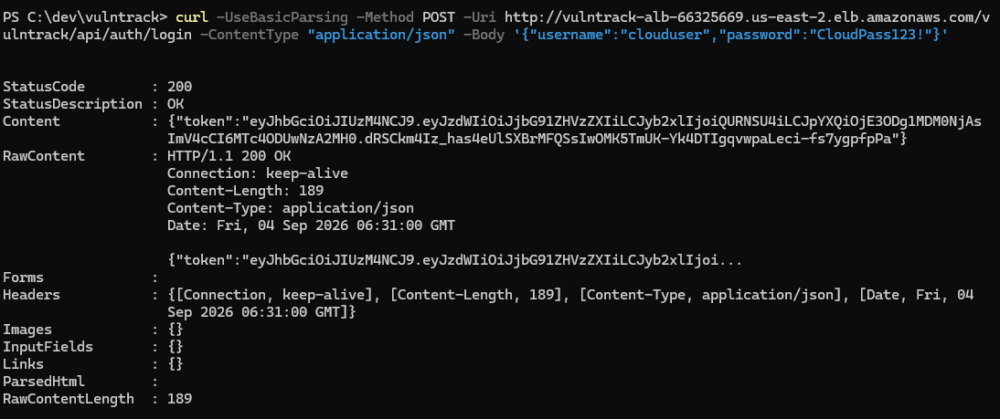
*A real JWT issued by the production deployment*

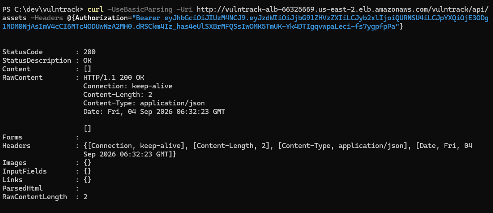
*The same token used to call a protected endpoint — `200 OK`, proving the
full auth chain works against RDS in the real environment*

> **Note on the JWT signing key**: `JwtUtil.java` reads `JWT_SIGNING_KEY`
> from the environment (injected by ECS from Secrets Manager in
> production), falling back to a clearly-commented dev-only value when
> that variable isn't set — so local Docker Compose runs need no
> configuration at all.

---

## Infrastructure as code

The entire AWS environment — VPC (public/private subnets across 2 AZs),
NAT gateway, tier-scoped security groups (ALB → ECS → RDS), an RDS
Postgres instance, an ECS Fargate cluster/service, an Application Load
Balancer, and two Secrets Manager entries (DB credentials, JWT key) — is
defined in [`terraform/`](terraform/) and provisioned with a single
`terraform apply`.

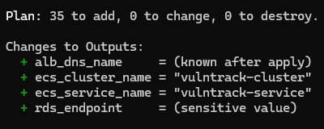
*Reviewing exactly what will be created before committing to it*

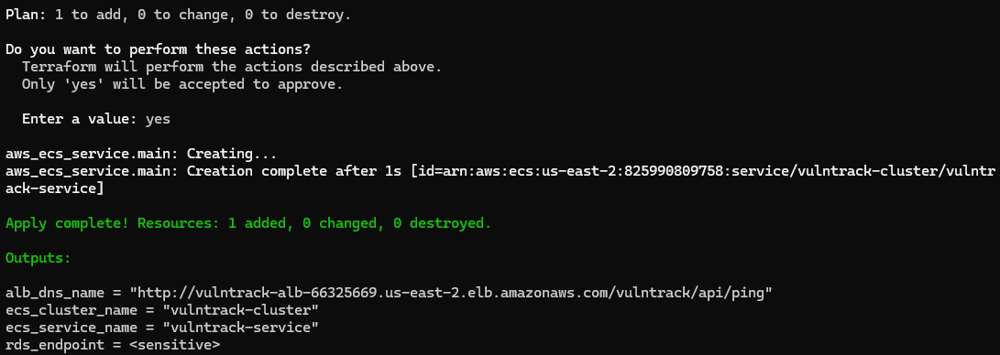
*`Apply complete!` — real AWS infrastructure, built entirely from code*

The environment is intentionally **not** left running between sessions —
`terraform destroy` tears everything down cleanly (RDS, NAT gateway, and
ALB all carry hourly cost), and `terraform apply` rebuilds it identically
whenever needed. The IAM identities, ECR repository, and GitHub OIDC setup
are separate from this Terraform config and persist across destroy/apply
cycles.

---

## CI/CD pipeline

Every push to `main` triggers [`.github/workflows/deploy.yml`](.github/workflows/deploy.yml):

1. Builds the app with Maven
2. Authenticates to AWS via **OIDC** — no long-lived credentials stored in
   GitHub at all; the IAM role's trust policy is scoped to
   `repo:DevinCodes13/vulntrack` on the `main` branch specifically
3. Builds the Docker image and pushes it to ECR
4. Forces a new ECS deployment and waits for the service to stabilize

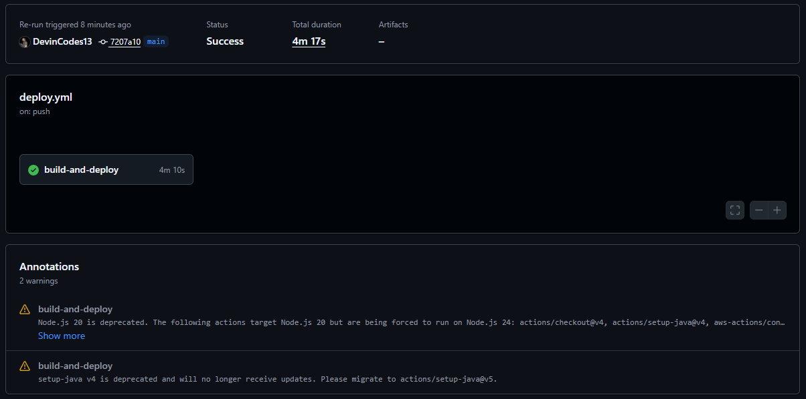
*A full build → push → deploy run, triggered automatically by `git push`*

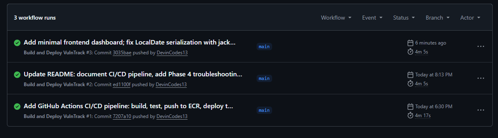
*Repeated, reliable automation — not a one-time fluke*

Getting here took real debugging, most notably a GitHub OIDC token format
change that broke the trust policy (diagnosed via CloudTrail, not
guesswork):

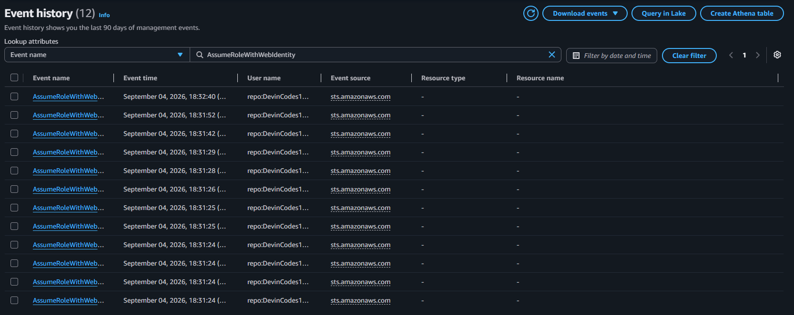
*Reading the actual `AssumeRoleWithWebIdentity` event to see exactly what
GitHub sent, rather than guessing from the generic "not authorized" error*

---

## Local development setup

### Prerequisites

- JDK 17 (Eclipse Temurin recommended)
- Maven 3.9+
- Docker Desktop (with WSL2 backend on Windows)

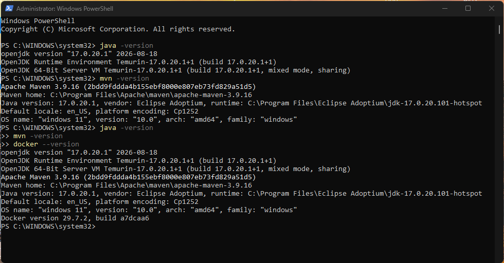
*Java, Maven, and Docker all verified in one terminal — after working
through several PATH/JAVA_HOME issues along the way*

### First-time setup

```powershell
git clone https://github.com/DevinCodes13/vulntrack.git
cd vulntrack
mvn clean package
docker compose up -d --build
```

The app is available at `http://localhost:8080/vulntrack/` (dashboard) and
`http://localhost:8080/vulntrack/api` (REST API). The WildFly admin
console is at `http://localhost:9990`.

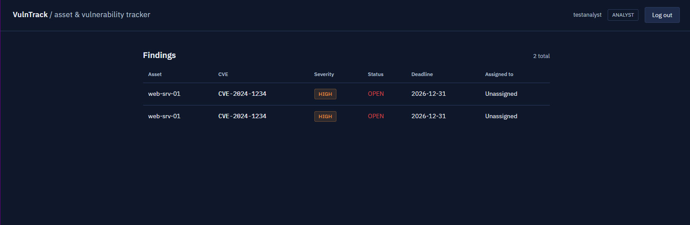

### Rebuilding after code changes

```powershell
mvn clean package
docker compose down
docker compose up -d --build
```

---

## Troubleshooting log & lessons learned

Kept here rather than smoothed over, since debugging real infrastructure
issues is a meaningful part of what this project demonstrates.

- **Maven archetype plugin failed outright** (`MissingProjectException`,
  instant failure, no clear cause) — scaffolded the project by hand
  instead of relying on `mvn archetype:generate`.
- **Adding a `NOT NULL` column via Hibernate's `hbm2ddl.auto=update`**
  failed against a table that already had rows with null values in that
  column:
  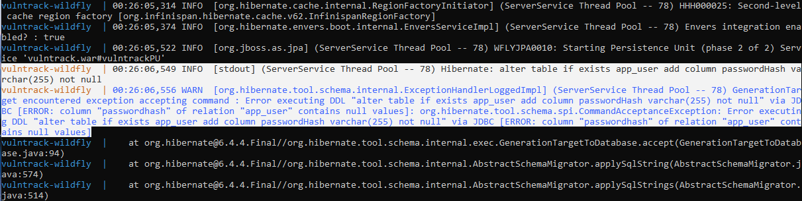
  Resolved by clearing conflicting test data before redeploying:
  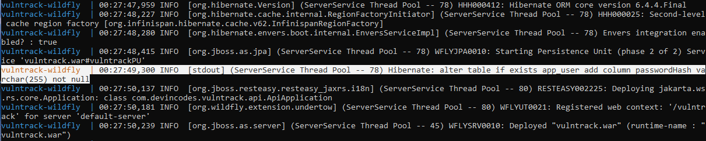
  A real limitation of auto-migration, and part of why production systems
  use versioned migration tools (Flyway/Liquibase) instead.
- **JAX-RS `UriInfo.getPath()` leading-slash inconsistency** caused the
  auth filter's path-exclusion check to silently fail, blocking even the
  registration endpoint — fixed by checking both `"auth/"` and `"/auth/"`.
- **CDI-proxied JAX-RS resources cannot reliably inject
  `ContainerRequestContext`** — RESTEasy throws
  `RESTEASY003880: Unable to find contextual data`. Resolved with a
  `@RequestScoped` CDI bean (`RequestUserContext`) shared between the auth
  filter and the resource classes.
- **Notepad silently appends `.txt`** to filenames without a recognized
  extension (`Dockerfile` → `Dockerfile.txt`) unless the filename is
  quoted in the Save As dialog or "All Files" is selected explicitly.
- **WildFly's embedded-server CLI bootstrap can silently prevent real
  deployment.** Copying the WAR into `standalone/deployments/` *before*
  running the offline `datasource.cli` configuration step causes WildFly
  to auto-deploy it during that embedded boot and bake an "already
  deployed" marker into the image layer — so the real container never
  deploys the app at runtime, with no error logged anywhere. Fixed by
  sequencing the Dockerfile so the WAR is copied in only *after* the CLI
  step completes.
- **ALB health checks cannot carry authentication headers.** Once JWT auth
  was added, the load balancer's health check to `/api/ping` started
  failing with 401s. The health check endpoint has to be explicitly
  exempted from the auth filter — application security and infrastructure
  health monitoring are different concerns with different requirements.
- **A prior project's hardened IAM policy blocked this one.** Reusing the
  `devin-developer` IAM user (from an earlier AWS hardening project) for
  Terraform failed because its `DeveloperLeastPrivilege` policy has an
  explicit `Deny` on security-group rule changes — which always overrides
  any `Allow`, even from a different attached policy. Resolved by creating
  a separate, purpose-scoped IAM user (`devin-terraform-vulntrack`) rather
  than loosening a different project's intentionally hardened policy.
- **GitHub's OIDC token `sub` claim format changed** to include immutable
  numeric owner/repo IDs (`repo:owner@org_id/repo@repo_id:ref:...`) rather
  than plain names, breaking an exact-match IAM trust policy written
  against the older format. Diagnosed via CloudTrail's
  `AssumeRoleWithWebIdentity` event history rather than guessing from the
  generic "not authorized" error. Resolved with a `StringLike` wildcard
  pattern that tolerates both formats.
- **A region placeholder in an IAM policy resource ARN went uncorrected**
  (`us-east-1` instead of the actual `us-east-2`), causing the GitHub
  Actions role to authenticate successfully via OIDC but still be denied
  `ecr:InitiateLayerUpload`:
  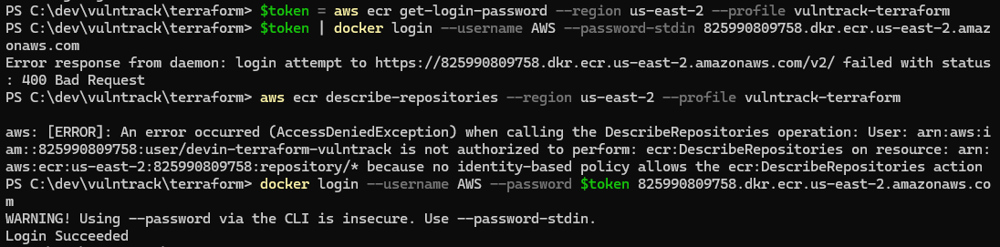
  A reminder that region-scoped ARNs in policy templates need to be
  checked against the actual deployment region, not left as a generic
  placeholder.
- **`docker login --password-stdin` failed with a 400 Bad Request** via
  PowerShell piping, despite valid credentials (confirmed by testing with
  `--password` directly instead) — a transport/encoding quirk specific to
  that Docker Desktop/PowerShell combination, not a credentials problem.
- **Destroying and recreating Secrets Manager entries hits AWS's default
  30-day recovery window** — a `terraform destroy` schedules secrets for
  deletion rather than purging them immediately, so a following
  `terraform apply` fails with "already scheduled for deletion." Setting
  `recovery_window_in_days = 0` makes destroy/recreate cycles clean.
- **IAM least-privilege is iterative, not perfect on the first try.**
  Building the Terraform IAM policy surfaced a long tail of missing
  read-back permissions (`ec2:DescribeVpcAttribute`,
  `iam:ListRolePolicies`, `secretsmanager:GetResourcePolicy`,
  `ec2:DisassociateAddress`, and others) that only appear once Terraform
  actually tries to read a resource back into state after creating it.
  Rather than chase each one individually, AWS's managed `ReadOnlyAccess`
  policy was layered on top of the narrower custom policy — read-only
  access is low-risk, and it resolved the remaining gaps in one pass while
  keeping all *write* access explicitly and narrowly scoped.

---

## Roadmap

- [x] Phase 1 — Maven/Jakarta EE scaffold, WildFly deployment, first REST endpoint
- [x] Phase 2 — PostgreSQL integration via custom WildFly datasource module
- [x] Phase 3 — JPA entity model, full CRUD REST API
- [x] Phase 3.5 — JWT authentication, bcrypt password hashing, role-based access control
- [x] Phase 4 — Infrastructure as code (Terraform), OIDC-based GitHub Actions CI/CD pipeline, minimal frontend dashboard, verified live end-to-end on AWS
- [ ] Phase 4+ — TLS/HTTPS on the ALB, tighter IAM scoping on the remaining broad grants

---

## Author

Devin Phillips — [github.com/DevinCodes13](https://github.com/DevinCodes13)
