# VulnTrack

A vulnerability and asset tracking web application built as a classic Java
3-tier stack — Jakarta EE on WildFly (JBoss), PostgreSQL, and a Dockerized
build/deploy pipeline. Built as a portfolio project to demonstrate full-stack
Java development, application-server administration, infrastructure as
code, and applied security in one connected system — and then deliberately
re-architected a second time onto Kubernetes with a real service mesh, to
demonstrate both approaches to running the same application in production.

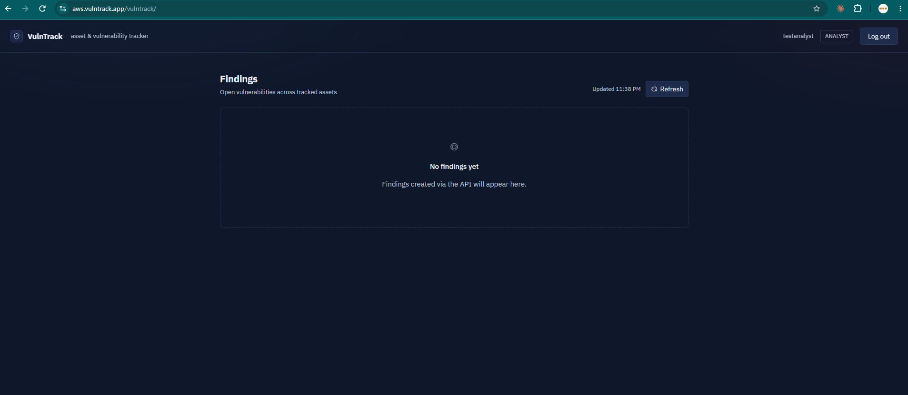
*The findings dashboard, served from `aws.vulntrack.app` — real domain,
real Let's Encrypt certificate, running on an EKS cluster behind an Istio
service mesh with mutual TLS between pods.*

---

## Two architectures, one application

This project was deliberately built **twice**, on two different AWS
compute platforms, to demonstrate range rather than pick one and stop:

| | Phase 4 — ECS/Fargate | Phase 5 — EKS/Kubernetes |
|---|---|---|
| Compute | ECS Fargate (serverless containers) | EKS managed node group (real Kubernetes) |
| Ingress | ALB via Terraform | ALB via Kubernetes Ingress + Istio Gateway |
| DNS | Manual Route53 record | ExternalDNS, fully automated |
| TLS | ACM | Let's Encrypt (cert-manager), bridged into ACM |
| Service-to-service security | N/A (single service) | Istio service mesh, STRICT mutual TLS |
| Terraform | [`terraform-ecs/`](terraform-ecs/) | [`terraform-eks/`](terraform-eks/) |

Both are real, working, documented builds. Only one runs at a time (cost
reasons — see [Infrastructure as code](#infrastructure-as-code)), but the
code for both is preserved in this repo.

---

## Table of contents

- [Architecture](#architecture)
- [Tech stack](#tech-stack)
- [Building it: from a failed archetype to a working REST API](#building-it-from-a-failed-archetype-to-a-working-rest-api)
- [Data model](#data-model)
- [API reference](#api-reference)
- [Authentication & authorization](#authentication--authorization)
- [Infrastructure as code](#infrastructure-as-code)
- [Phase 5: Kubernetes, a service mesh, and real TLS automation](#phase-5-kubernetes-a-service-mesh-and-real-tls-automation)
- [CI/CD pipeline](#cicd-pipeline)
- [Local development setup](#local-development-setup)
- [Troubleshooting log & lessons learned](#troubleshooting-log--lessons-learned)
- [Roadmap](#roadmap)

---

## Architecture

Classic 3-tier design at the application level, regardless of which
compute platform it's running on:

- **Presentation tier**: a lightweight static frontend (vanilla HTML/JS,
  no build step) plus a REST API, both served from the same WildFly
  deployment
- **Application tier**: Jakarta EE (JAX-RS + CDI) on WildFly, containerized
  via a custom Docker image
- **Data tier**: PostgreSQL, with a hand-installed WildFly datasource
  module rather than the default H2 example

**Phase 4 (ECS):**
```
 Browser ──> ALB ──> WildFly on ECS Fargate ──> PostgreSQL (RDS)
```

**Phase 5 (EKS):**
```
 Browser ──> Route53 (ExternalDNS) ──> ALB (WAF attached) ──> Istio Ingress Gateway
              ──mTLS──> WildFly pod + Envoy sidecar ──> PostgreSQL (RDS)
```

Locally, both phases run identically via Docker Compose — the app itself
doesn't know or care which cloud architecture it's deployed on, since all
environment-specific config (datasource host, JWT key) is injected at
runtime, not baked into the image.

See [`docs/diagrams/vulntrack-er-diagram.md`](docs/diagrams/vulntrack-er-diagram.md)
for the full entity-relationship diagram (renders automatically on GitHub).

---

## Tech stack

| Layer | Technology |
|---|---|
| Application server | WildFly 31 (JBoss) |
| Language / runtime | Java 17 (Eclipse Temurin) |
| Web framework | Jakarta EE 10 (JAX-RS, CDI) |
| ORM | Hibernate 6 / Jakarta Persistence |
| Database | PostgreSQL 16 |
| Auth | JWT (jjwt) + bcrypt (jBCrypt) |
| Frontend | Vanilla HTML/CSS/JS, no framework or build step |
| Build | Maven |
| Containerization | Docker, Docker Compose |
| Compute (Phase 4) | ECS Fargate |
| Compute (Phase 5) | EKS (Kubernetes), managed node group |
| Service mesh (Phase 5) | Istio — Ingress Gateway, sidecar injection, STRICT mTLS |
| DNS (Phase 5) | Route53 + ExternalDNS (automated) |
| TLS (Phase 5) | Let's Encrypt via cert-manager, bridged into ACM |
| WAF | AWS WAFv2 — managed rule groups + rate limiting |
| Infrastructure | Terraform (two independent root modules) |
| CI/CD | GitHub Actions, OIDC-authenticated (no stored AWS credentials) |

---

## Building it: from a failed archetype to a working REST API

The Maven archetype plugin failed outright on the very first command, so
the project was scaffolded by hand instead — writing `pom.xml` and the
folder structure directly rather than relying on generated templates.


*The first clean `mvn validate` after hand-writing the Maven configuration*

That led to the first real milestone: WildFly running in Docker, serving a
REST endpoint end to end.


*Maven → WAR → WildFly → REST, working end to end for the first time*

---

## Data model

Four core entities: `Asset`, `Vulnerability`, `Finding` (the join entity
linking a vulnerability to an asset with a status and remediation
deadline), and `AppUser`.

PostgreSQL runs as its own container/RDS instance with a **hand-installed
JDBC driver module** — WildFly doesn't ship one — configured via a CLI
script that runs during the Docker image build:


*Registers the PostgreSQL driver and creates the `VulnTrackDS` datasource,
using `${env.VAR:default}` expressions so the same image works unchanged
across local Docker Compose, ECS, and EKS*


*WildFly's default `ExampleDS` alongside the custom `VulnTrackDS`*


*Hibernate mapped all four JPA entities to real Postgres tables*


*A single SQL join across all four tables — the clearest proof the
relational model is correct, not just that the tables exist*

---

## API reference

Base path: `/vulntrack/api`

| Method | Endpoint | Auth required | Notes |
|---|---|---|---|
| POST | `/auth/register` | No | Creates a user (bcrypt-hashed password) |
| POST | `/auth/login` | No | Returns a signed JWT (1-hour expiry) |
| GET | `/assets` | Yes | List all assets |
| GET | `/assets/{id}` | Yes | Get one asset |
| POST | `/assets` | Yes | Create an asset |
| PUT | `/assets/{id}` | Yes | Update an asset |
| DELETE | `/assets/{id}` | Yes (**ADMIN only**) | Delete an asset |
| GET / POST / PUT / DELETE | `/vulnerabilities`, `/vulnerabilities/{id}` | Yes | Same CRUD pattern |
| GET / POST / PUT / DELETE | `/users`, `/users/{id}` | Yes | Same CRUD pattern |
| GET / POST / PUT / DELETE | `/findings`, `/findings/{id}` | Yes | Accepts `assetId` / `vulnerabilityId` / `assignedUserId` in the request body; the server resolves the actual entities |


*`201 Created` confirming the full write path — REST → JPA → Postgres*

---

## Authentication & authorization

- Passwords are hashed with bcrypt before storage — never stored plain
- `POST /auth/login` returns a JWT signed with HS384, containing the
  username (`sub`) and role (`role`) claims
- A `ContainerRequestFilter` (`AuthFilter`) validates the
  `Authorization: Bearer <token>` header on every request except
  `/auth/*` and the health-check endpoint `/ping`
- Role checks are enforced per-endpoint using a `@RequestScoped` CDI bean
  (`RequestUserContext`) shared between the filter and the resource
  classes — a CDI-proxied JAX-RS resource can't reliably inject
  `ContainerRequestContext` directly, so this bean bridges the filter and
  the resource cleanly (see [Troubleshooting log](#troubleshooting-log--lessons-learned))
- Example: `DELETE /assets/{id}` is restricted to `ADMIN`; `ANALYST` users
  get `403 Forbidden`

Verified against a **live AWS deployment**, not just locally:


*A real JWT issued by the production deployment*


*The same token used to call a protected endpoint — `200 OK`, proving the
full auth chain works against RDS in the real environment*

> **Note on the JWT signing key**: `JwtUtil.java` reads `JWT_SIGNING_KEY`
> from the environment (injected from Secrets Manager in both the ECS and
> EKS deployments), falling back to a clearly-commented dev-only value
> when that variable isn't set — so local Docker Compose runs need no
> configuration at all.

---

## Infrastructure as code

The AWS environment — VPC, security groups, RDS, compute, load balancer,
Secrets Manager — is fully defined in Terraform, in **two independent
root modules**:

- [`terraform-ecs/`](terraform-ecs/) — the original Phase 4 build: ECS
  Fargate, ALB with ACM, Secrets Manager
- [`terraform-eks/`](terraform-eks/) — the Phase 5 rebuild: EKS, IRSA
  roles for every mesh/DNS/cert component, RDS, WAF, EKS access entries


*Reviewing exactly what will be created before committing to it*


*`Apply complete!` — real AWS infrastructure, built entirely from code*

Neither environment is left running continuously — RDS, NAT gateways, and
EKS's control plane all carry real hourly cost. `terraform destroy` tears
everything down cleanly; `terraform apply` rebuilds it identically. IAM
identities, the ECR repository, and the GitHub OIDC provider are shared
infrastructure outside either Terraform module and persist across
destroy/apply cycles for both.

---

## Phase 5: Kubernetes, a service mesh, and real TLS automation

Phase 4 proved the application worked well on serverless containers.
Phase 5 asks a different question: what does the same application look
like on a real, self-managed Kubernetes cluster, with a service mesh
providing pod-to-pod encryption and a fully automated DNS/TLS chain?

### Reorganizing for two architectures

The existing ECS Terraform config was moved into its own folder before
any EKS work began, so neither build could interfere with the other:

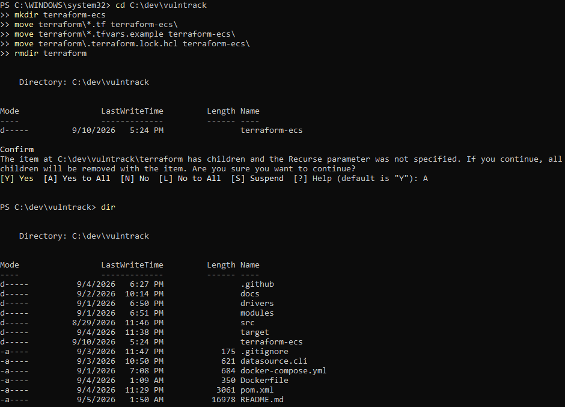

### Domain and DNS delegation

`vulntrack.app` was registered through Cloudflare — and Cloudflare's
registrar terms **contractually require using Cloudflare's own
nameservers**, which blocks the planned Route53 integration outright (not
a missing feature — an explicit registrar policy). Rather than wait out
the mandatory 60-day ICANN transfer lock, DNS was delegated one level
down: a Route53 hosted zone was created for `aws.vulntrack.app`
specifically, and Cloudflare was given an `NS` record pointing that one
subdomain at Route53. Everything under `aws.vulntrack.app` is fully
Route53-managed; the root domain stays with Cloudflare.

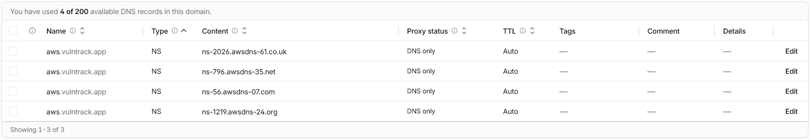
*Four Route53 nameservers registered as an NS record for the `aws`
subdomain — delegation confirmed working within minutes*

### The EKS cluster

A dedicated VPC, an EKS control plane, and a managed EC2 node group —
deliberately **not** Fargate profiles, since Istio's sidecar networking
requires `iptables` manipulation that Fargate doesn't support.

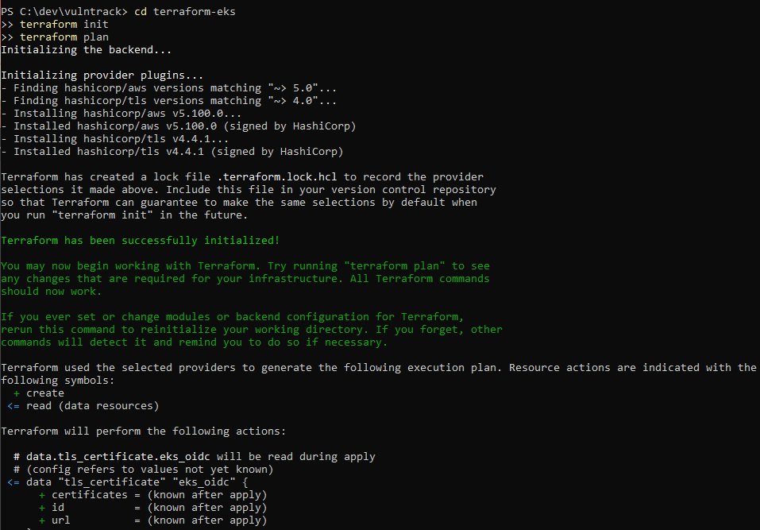

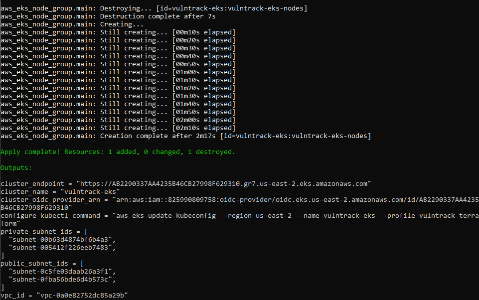

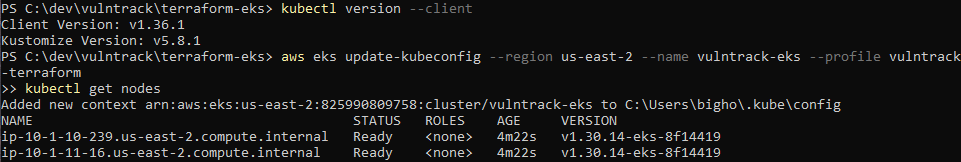

The AWS Load Balancer Controller was installed via Helm shortly after —
this is what lets a Kubernetes `Ingress` resource provision a real ALB:

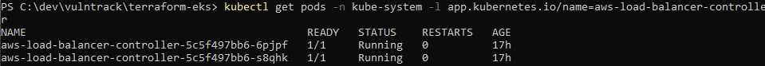

### The pod-density ceiling (and the proper fix)

Once cert-manager and the Istio control plane were added, pods started
getting stuck `Pending` even with spare CPU/memory showing on every node:

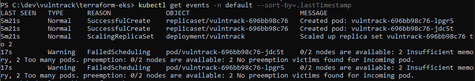

The real cause: `t3.micro`'s network interfaces can only hand out **4 pod
IPs per node**, a hard ceiling completely unrelated to CPU or RAM. A quick
node-count increase unblocked things temporarily —

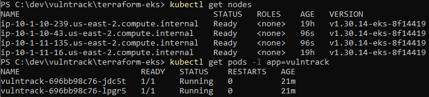

— but with Istio about to inject a sidecar into every pod (roughly
doubling pod count), that was only ever a stopgap. The actual fix: enable
**VPC CNI prefix delegation** and a custom node-group launch template
overriding `kubelet`'s `maxPods`, raising per-node capacity from 4 to 30:

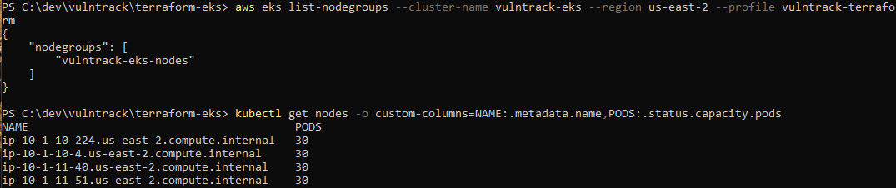
*Three independent sources — Terraform state, the AWS API, and
`kubectl` itself — all agreeing the fix genuinely worked*

Getting the fix in required two IAM permissions no prior phase had ever
needed (`ec2:CreateLaunchTemplate`, and separately `ec2:RunInstances` —
EKS validates the *calling user's* launch-template permissions before
delegating the actual launch to its own service role) — see the
[Troubleshooting log](#troubleshooting-log--lessons-learned) for the full
diagnostic path.

### Ingress, TLS, and WAF

A Kubernetes `Ingress` resource triggers the Load Balancer Controller to
provision a real ALB:

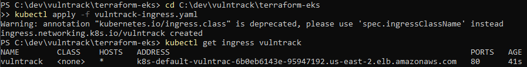

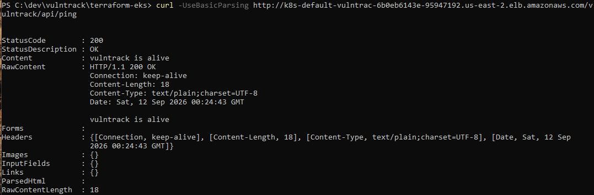

**TLS**: ALB's HTTPS listener only accepts ACM (or IAM-uploaded)
certificates natively — it has no way to reference a `cert-manager`
Secret directly. So the real certificate is issued by **Let's Encrypt**
via `cert-manager`, using a DNS-01 challenge solved automatically through
Route53 (an IRSA role scoped to exactly the `aws.vulntrack.app` hosted
zone, nothing else):

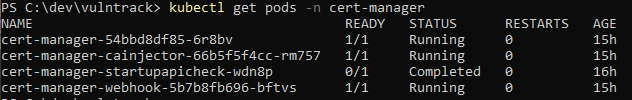

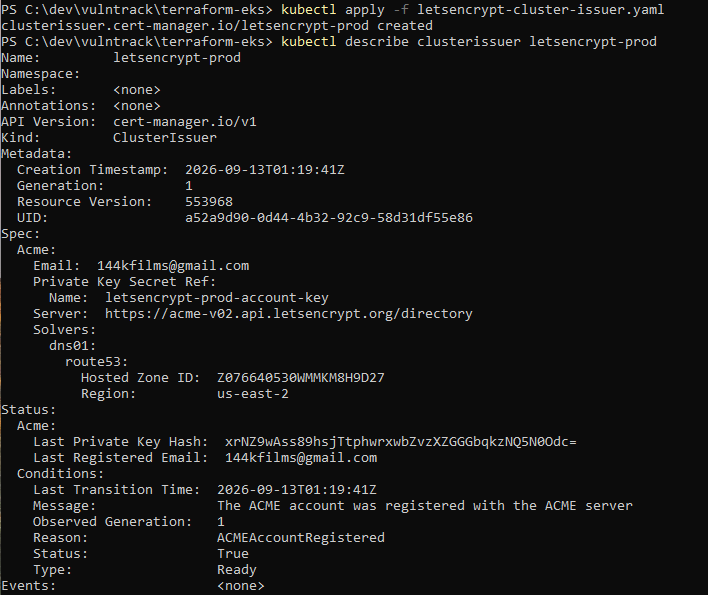

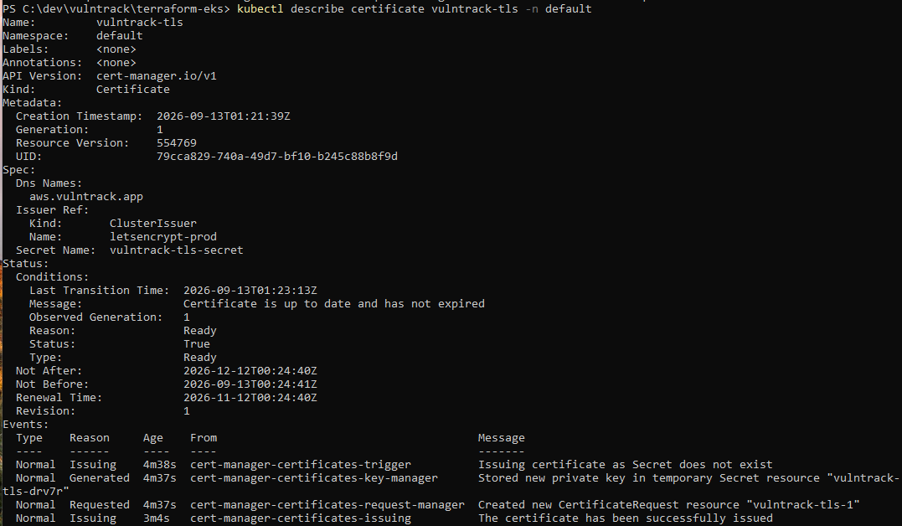
*A real, valid certificate — issued, not self-signed, with normal 90-day
Let's Encrypt expiry and cert-manager auto-renewal*

That certificate is then **manually bridged into ACM** — extracting the
cert/key from the Kubernetes Secret cert-manager creates, splitting the
leaf certificate from its intermediate chain (Let's Encrypt returns them
concatenated; ACM's API wants them separate), and importing the result:

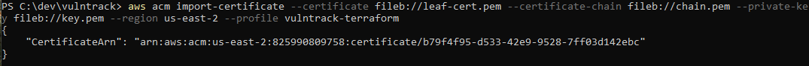

> This bridge is a **manual, non-auto-renewing step** — a known,
> documented tradeoff of choosing Let's Encrypt specifically to
> demonstrate `cert-manager` skills, rather than just using ACM's own
> (free, auto-renewing) certificates directly. A production setup would
> automate the re-import on every 90-day renewal.

**DNS**: rather than a static Terraform record (which would go stale the
moment the ALB is recreated), **ExternalDNS** watches the Ingress and
manages the Route53 record automatically:

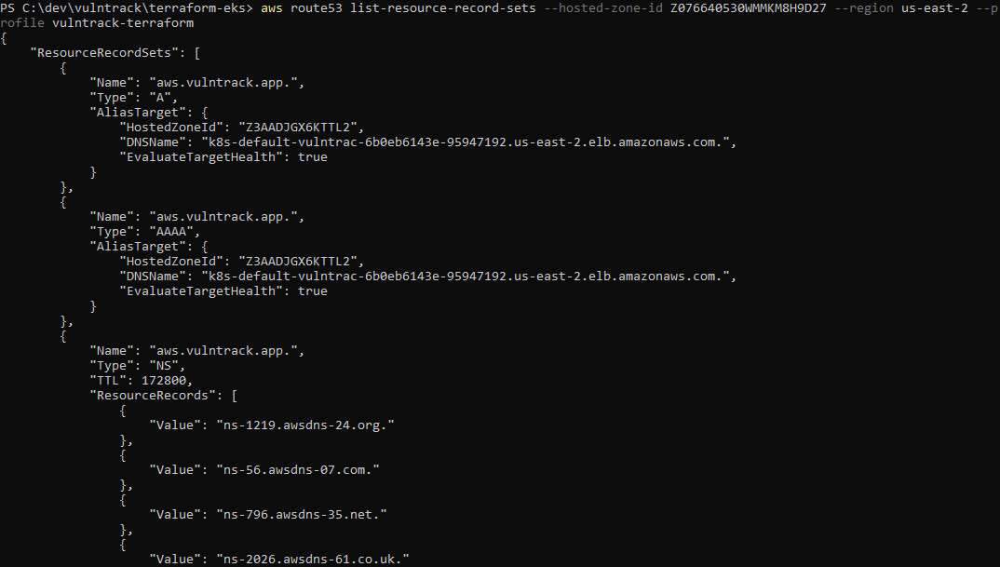

**WAF**: an AWS WAFv2 Web ACL — three AWS-managed rule groups (common
exploits, known bad inputs, and SQL injection specifically, a fitting
choice for a vulnerability tracker) plus IP-based rate limiting — attached
directly to the ALB:

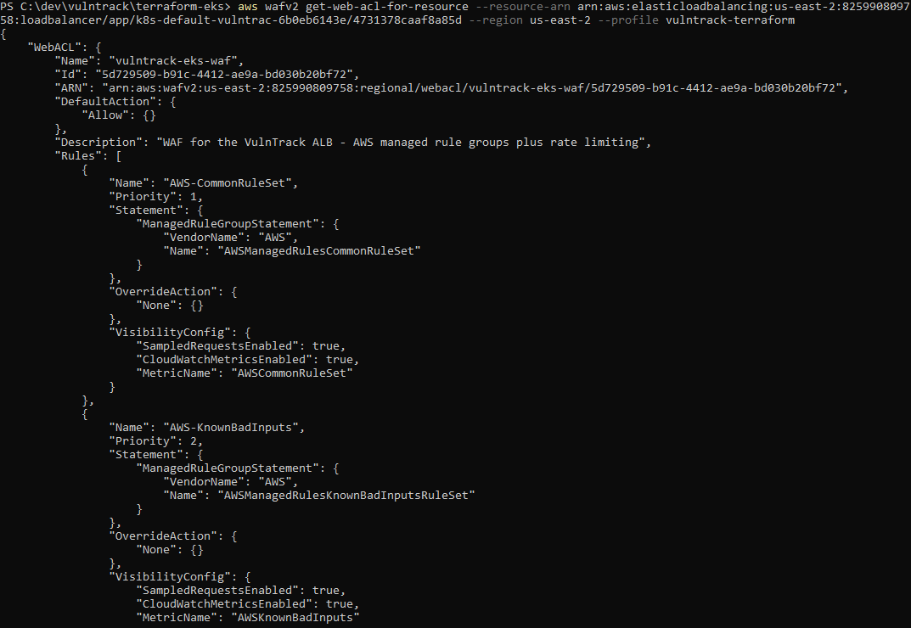

All of it working together, live, over real HTTPS, on the actual domain:

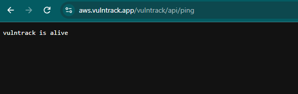

### The service mesh: Istio with STRICT mTLS

Istio was installed via Helm — control plane (`istiod`), then a dedicated
**Istio Ingress Gateway** sitting between the ALB and the app (so the ALB
still does TLS termination and WAF, but everything past that point is
mesh-native and can enforce real mTLS):

```
 ALB (TLS + WAF) ──plaintext──> Istio Ingress Gateway ──mTLS──> VulnTrack pod + Envoy sidecar
```

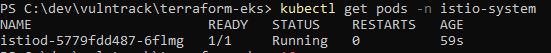

Istio's default control-plane resource requests (2Gi memory for `istiod`
alone) exceed a single `t3.micro`'s *entire* RAM — not a "needs more
nodes" problem, since no number of 1GB nodes can satisfy a pod that needs
2GB on one node. Resolved by overriding `istiod` and the gateway's
resource requests down to values that actually fit — a legitimate,
explained tradeoff for a cost-constrained demo environment, not something
a real production cluster would do.

The gateway rewire itself happened **without taking the live site down**:

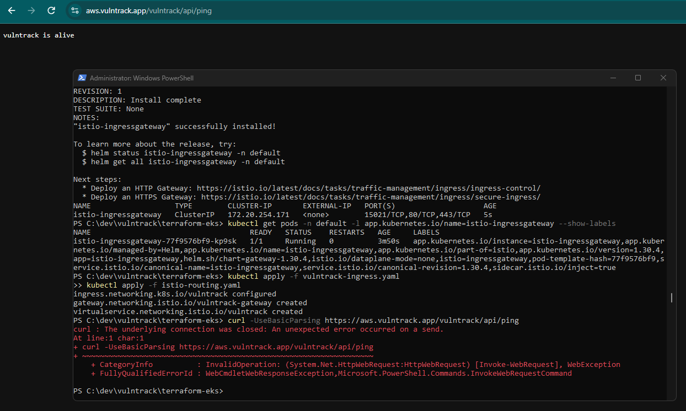

Enabling sidecar injection and restarting the app confirmed both
containers per pod — the app, and its injected Envoy proxy:

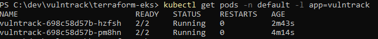

That injection alone reintroduced the pod-density problem from a second
angle: the sidecar's *own* default resource requests, combined with the
app's, exceeded what a single `t3.micro` node could satisfy for even one
pod — a real, concrete number (~640Mi combined, against roughly ~600–700Mi
of actually-usable memory per node). Fixed by right-sizing both the app's
request and the sidecar's request via `sidecar.istio.io/proxyMemory`
overrides, rather than continuing to add nodes indefinitely.

Finally, a `PeerAuthentication` policy enforcing **STRICT** mTLS —
scoped specifically to the `vulntrack` app pods, not the whole namespace,
since the Ingress Gateway (which legitimately receives plaintext from the
non-mesh ALB) also lives there:

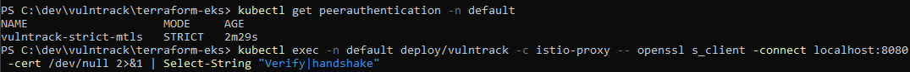

The strongest proof STRICT mode is genuinely enforcing encryption: a
misconfigured STRICT policy simply refuses non-mTLS connections outright
— so the fact that the site kept responding normally after this policy
was applied *is itself* the confirmation that Gateway → Pod traffic is
real, encrypted mTLS.

### Re-pointing CI/CD at EKS

The existing GitHub Actions pipeline (Phase 4) deployed to ECS — which no
longer exists once EKS became the active environment. Redirecting it
required two separate, easy-to-miss pieces beyond just editing the
workflow file:

1. **AWS-level IAM permissions** (`eks:DescribeCluster`, so
   `aws eks update-kubeconfig` can even find the cluster)
2. **Kubernetes-level RBAC access** via an **EKS access entry** — AWS IAM
   permissions and in-cluster Kubernetes permissions are two entirely
   separate authorization systems, and having one grants nothing in the
   other

The access entry is scoped to `edit` permissions in the `default`
namespace only — enough to restart a deployment, nowhere near
cluster-admin.

While reviewing the Terraform plan for this change, a subtle mistake
would have **destroyed and recreated the entire EKS cluster** — adding an
`access_config` block without also specifying
`bootstrap_cluster_creator_admin_permissions` (a create-time-only
attribute) made Terraform think that value needed to change, which forces
full cluster replacement. Caught by reading the plan output line-by-line
before applying, rather than trusting the summary — full story in the
[Troubleshooting log](#troubleshooting-log--lessons-learned).

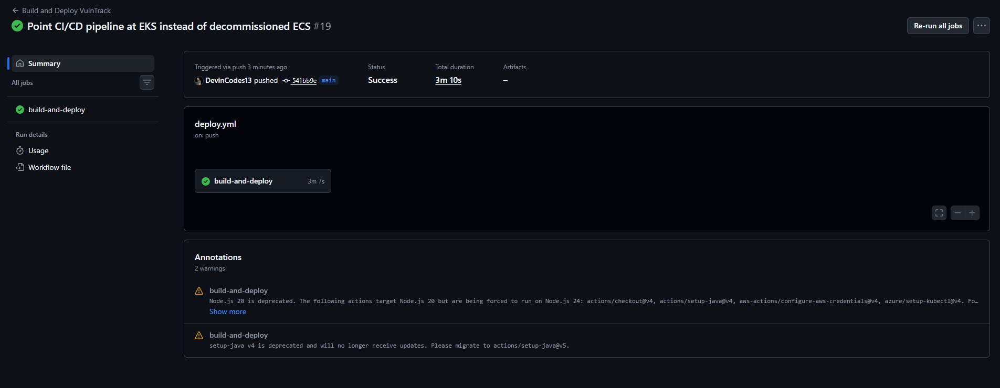
*Build → push to ECR → authenticate via OIDC → connect to EKS → rollout
restart, all green on the very first run against the newly-wired access
entry*

---

## CI/CD pipeline

Every push to `main` triggers [`.github/workflows/deploy.yml`](.github/workflows/deploy.yml):

1. Builds the app with Maven
2. Authenticates to AWS via **OIDC** — no long-lived credentials stored in
   GitHub at all; the IAM role's trust policy is scoped to
   `repo:DevinCodes13/vulntrack` on the `main` branch specifically
3. Builds the Docker image and pushes it to ECR
4. Connects to the EKS cluster and performs a rolling restart, waiting for
   the rollout to finish before the workflow reports success


Getting the OIDC trust policy right took real debugging, most notably a
GitHub token format change that broke an exact-match trust policy
(diagnosed via CloudTrail, not guesswork):


*Reading the actual `AssumeRoleWithWebIdentity` event to see exactly what
GitHub sent, rather than guessing from the generic "not authorized" error*

---

## Local development setup

### Prerequisites

- JDK 17 (Eclipse Temurin recommended)
- Maven 3.9+
- Docker Desktop (with WSL2 backend on Windows)


*Java, Maven, and Docker all verified in one terminal — after working
through several PATH/JAVA_HOME issues along the way*

### First-time setup

```powershell
git clone https://github.com/DevinCodes13/vulntrack.git
cd vulntrack
mvn clean package
docker compose up -d --build
```

The app is available at `http://localhost:8080/vulntrack/` (dashboard) and
`http://localhost:8080/vulntrack/api` (REST API). The WildFly admin
console is at `http://localhost:9990`.


### Rebuilding after code changes

```powershell
mvn clean package
docker compose down
docker compose up -d --build
```

---

## Troubleshooting log & lessons learned

Kept here rather than smoothed over, since debugging real infrastructure
issues is a meaningful part of what this project demonstrates.

### Phase 1–4

- **Maven archetype plugin failed outright** (`MissingProjectException`,
  instant failure, no clear cause) — scaffolded the project by hand
  instead of relying on `mvn archetype:generate`.
- **Adding a `NOT NULL` column via Hibernate's `hbm2ddl.auto=update`**
  failed against a table that already had rows with null values in that
  column. Resolved by clearing conflicting test data before redeploying —
  a real limitation of auto-migration, and part of why production systems
  use versioned migration tools (Flyway/Liquibase) instead.
- **JAX-RS `UriInfo.getPath()` leading-slash inconsistency** caused the
  auth filter's path-exclusion check to silently fail, blocking even the
  registration endpoint — fixed by checking both `"auth/"` and `"/auth/"`.
- **CDI-proxied JAX-RS resources cannot reliably inject
  `ContainerRequestContext`** — RESTEasy throws
  `RESTEASY003880: Unable to find contextual data`. Resolved with a
  `@RequestScoped` CDI bean (`RequestUserContext`) shared between the auth
  filter and the resource classes.
- **Notepad silently appends `.txt`** to filenames without a recognized
  extension (`Dockerfile` → `Dockerfile.txt`) unless the filename is
  quoted in the Save As dialog or "All Files" is selected explicitly.
- **WildFly's embedded-server CLI bootstrap can silently prevent real
  deployment.** Copying the WAR into `standalone/deployments/` *before*
  running the offline `datasource.cli` configuration step causes WildFly
  to auto-deploy it during that embedded boot and bake an "already
  deployed" marker into the image layer, so the real container never
  deploys the app at runtime, with no error logged anywhere. Fixed by
  sequencing the Dockerfile so the WAR is copied in only *after* the CLI
  step completes.
- **ALB health checks cannot carry authentication headers.** Once JWT auth
  was added, the load balancer's health check to `/api/ping` started
  failing with 401s. The health check endpoint has to be explicitly
  exempted from the auth filter — application security and infrastructure
  health monitoring are different concerns with different requirements.
- **A prior project's hardened IAM policy blocked this one.** Reusing an
  IAM user from an earlier AWS hardening project for Terraform failed
  because its policy has an explicit `Deny` on security-group rule
  changes — which always overrides any `Allow`, even from a different
  attached policy. Resolved by creating a separate, purpose-scoped IAM
  user rather than loosening a different project's intentionally hardened
  policy.
- **GitHub's OIDC token `sub` claim format changed** to include immutable
  numeric owner/repo IDs rather than plain names, breaking an exact-match
  IAM trust policy written against the older format. Diagnosed via
  CloudTrail's `AssumeRoleWithWebIdentity` event history rather than
  guessing from the generic "not authorized" error. Resolved with a
  `StringLike` wildcard pattern that tolerates both formats.
- **A region placeholder in an IAM policy resource ARN went uncorrected**
  (`us-east-1` instead of the actual `us-east-2`), causing the GitHub
  Actions role to authenticate successfully via OIDC but still be denied
  `ecr:InitiateLayerUpload` — a reminder that region-scoped ARNs in policy
  templates need to be checked against the actual deployment region.
- **`docker login --password-stdin` failed with a 400 Bad Request** via
  PowerShell piping, despite valid credentials (confirmed by testing with
  `--password` directly instead) — a transport/encoding quirk specific to
  that Docker Desktop/PowerShell combination, not a credentials problem.
- **Destroying and recreating Secrets Manager entries hits AWS's default
  30-day recovery window** — a `terraform destroy` schedules secrets for
  deletion rather than purging them immediately. Setting
  `recovery_window_in_days = 0` makes destroy/recreate cycles clean.
- **IAM least-privilege is iterative, not perfect on the first try.**
  Building each Terraform IAM policy surfaced a long tail of missing
  read-back permissions that only appear once Terraform actually tries to
  read a resource back into state after creating it. Rather than chase
  each one individually, AWS's managed `ReadOnlyAccess` policy was layered
  on top of the narrower custom policy.

### Phase 5

- **Cloudflare Registrar contractually forbids changing nameservers.**
  Discovered after registering `vulntrack.app` there specifically for the
  Route53 integration — Cloudflare's terms require using their own
  nameservers, and newly-registered domains carry a mandatory 60-day
  ICANN transfer lock regardless of registrar. Resolved by delegating a
  subdomain (`aws.vulntrack.app`) to Route53 via an `NS` record, rather
  than waiting out the lock or switching registrars.
- **AWS account "Free Tier" flags restrict more than just billing.**
  Beyond blocking Route53 domain registration outright, the same flag
  blocked launching non-free-tier EC2 instance types (`t3.medium` failed
  with "not eligible for Free Tier"), forcing the entire EKS node group
  onto `t3.micro` — which then drove several of the harder problems below.
- **EKS managed node groups cap pod density by instance networking
  capacity, not CPU/memory.** `t3.micro` supports only 4 pod IPs per node
  — a ceiling completely invisible in `kubectl top` or resource
  dashboards, only surfacing as `FailedScheduling: ... Too many pods`.
  Fixed properly (not just by adding nodes indefinitely) by enabling VPC
  CNI prefix delegation and a custom launch template overriding kubelet's
  `maxPods`, raising the real per-node ceiling to 30.
- **A custom EKS node-group launch template requires IAM permissions no
  standard node group ever needs**: `ec2:CreateLaunchTemplate`, and
  separately `ec2:RunInstances` — EKS validates that the *calling IAM
  principal* (not just its own service role) could launch an instance
  with that template, before delegating the actual launch internally.
  Neither permission had ever been needed before this specific change.
- **A `terraform apply` that reported success wasn't actually
  succeeding.** Two consecutive "Apply complete!" results were followed
  by the created resources vanishing entirely from both Terraform state
  and AWS's own API. Root-caused by reading a *complete*, unedited log
  rather than a summarized one: an explicit `Error: creating EKS Node
  Group ... CREATE_FAILED` block had been present in the output the whole
  time. Terraform's own provider automatically rolls back (deletes) a
  node group that fails its post-creation health check — which looked
  identical to a mysterious external process deleting things, until the
  actual error text was read directly. The underlying cause was a
  malformed `nodeadm` YAML config, produced by Terraform heredoc
  indentation stripping not behaving as expected; rewritten using
  explicit zero-indentation string concatenation instead.
- **Istio's default control-plane and gateway resource requests assume
  real infrastructure**, not a single `t3.micro`. `istiod`'s default 2Gi
  memory request exceeds an entire node's total RAM — not fixable by
  adding more nodes, since a pod's request has to fit on *one* node.
  Resolved by explicitly overriding `istiod` and the gateway's resource
  requests to fit, with the tradeoff clearly documented rather than
  silently normalized.
- **ExternalDNS silently generates zero DNS records with no error**, if
  its `sources` config doesn't explicitly include `ingress` (the Helm
  chart's default doesn't) — and separately, if the target `Ingress`
  relies on the deprecated `kubernetes.io/ingress.class` annotation
  instead of `spec.ingressClassName`. Both symptoms look identical
  ("All records are already up to date," forever) and were only
  distinguished by turning on debug-level logging and reading the literal
  per-resource skip reason (`"No endpoints could be generated from
  ingress/default/vulntrack"`) rather than guessing from the calm,
  error-free info-level logs.
- **A Terraform plan that looked like a routine config update would have
  destroyed the entire EKS cluster.** Adding an `access_config` block to
  enable EKS access entries, without also specifying the create-time-only
  `bootstrap_cluster_creator_admin_permissions` attribute, made Terraform
  treat that value as changing — which forces full cluster replacement
  (cascading into the OIDC provider and every IRSA trust policy that
  references it). Caught by reading the complete plan output before
  applying and specifically checking for `must be replaced` versus
  `will be updated in-place`, rather than trusting a plan summary line.
- **AWS-level IAM permissions and in-cluster Kubernetes RBAC are two
  entirely separate authorization systems.** Granting the GitHub Actions
  IAM role `eks:DescribeCluster` was necessary but not sufficient for the
  CI/CD pipeline to actually run `kubectl` commands against the cluster —
  it also needed an explicit **EKS access entry** mapping that IAM
  principal to real Kubernetes RBAC permissions, since IAM permissions
  alone grant no visibility or control inside the cluster itself.

---

## Roadmap

- [x] Phase 1 — Maven/Jakarta EE scaffold, WildFly deployment, first REST endpoint
- [x] Phase 2 — PostgreSQL integration via custom WildFly datasource module
- [x] Phase 3 — JPA entity model, full CRUD REST API
- [x] Phase 3.5 — JWT authentication, bcrypt password hashing, role-based access control
- [x] Phase 4 — Infrastructure as code (Terraform), OIDC-based GitHub Actions CI/CD pipeline, minimal frontend dashboard, verified live end-to-end on AWS (ECS/Fargate)
- [x] Phase 5 — Re-architected onto EKS: Route53 + ExternalDNS, Let's Encrypt via cert-manager (bridged into ACM), AWS WAF, and a full Istio service mesh with STRICT mutual TLS between pods. CI/CD pipeline re-pointed from ECS to EKS with proper Kubernetes RBAC access.
- [ ] Phase 5+ — Automated Let's Encrypt → ACM renewal (currently a manual bridge), External Secrets Operator instead of manually-synced Kubernetes Secrets, tighter IAM scoping on the remaining broad grants

---

## Author

Devin Phillips — [github.com/DevinCodes13](https://github.com/DevinCodes13)
