# VulnTrack

A vulnerability and asset tracking web application built as a classic Java
3-tier stack — Jakarta EE on WildFly (JBoss), PostgreSQL, and a Dockerized
build/deploy pipeline. Built as a portfolio project to demonstrate full-stack
Java development, application-server administration, infrastructure as
code, and applied security in one connected system — and then deliberately
re-architected a second time onto Kubernetes with a real service mesh, to
demonstrate both approaches to running the same application in production.

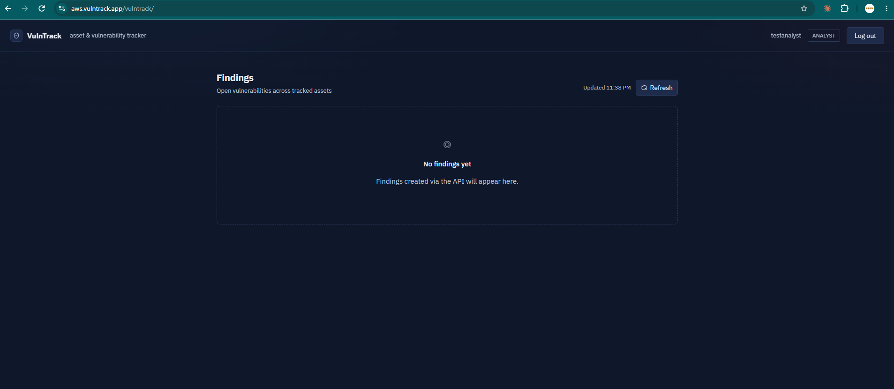
*The findings dashboard, served from `aws.vulntrack.app` — real domain,
real Let's Encrypt certificate, running on an EKS cluster behind an Istio
service mesh with mutual TLS between pods.*

---

## Two architectures, one application

This project was deliberately built **twice**, on two different AWS
compute platforms, to demonstrate range rather than pick one and stop:

| | Phase 4 — ECS/Fargate | Phase 5 — EKS/Kubernetes |
|---|---|---|
| Compute | ECS Fargate (serverless containers) | EKS managed node group (real Kubernetes) |
| Ingress | ALB via Terraform | ALB via Kubernetes Ingress + Istio Gateway |
| DNS | Manual Route53 record | ExternalDNS, fully automated |
| TLS | ACM | Let's Encrypt (cert-manager), bridged into ACM |
| Service-to-service security | N/A (single service) | Istio service mesh, STRICT mutual TLS |
| Terraform | [`terraform-ecs/`](terraform-ecs/) | [`terraform-eks/`](terraform-eks/) |

Both are real, working, documented builds. Only one runs at a time (cost
reasons — see [Infrastructure as code](#infrastructure-as-code)), but the
code for both is preserved in this repo.

---

## Table of contents

- [Architecture](#architecture)
- [Tech stack](#tech-stack)
- [Building it: from a failed archetype to a working REST API](#building-it-from-a-failed-archetype-to-a-working-rest-api)
- [Data model](#data-model)
- [API reference](#api-reference)
- [Authentication & authorization](#authentication--authorization)
- [Infrastructure as code](#infrastructure-as-code)
- [Phase 5: Kubernetes, a service mesh, and real TLS automation](#phase-5-kubernetes-a-service-mesh-and-real-tls-automation)
- [Phase 6: Proving the rebuild](#phase-6-proving-the-rebuild)
- [Phase 7: Hardening what was already running](#phase-7-hardening-what-was-already-running)
- [CI/CD pipeline](#cicd-pipeline)
- [Local development setup](#local-development-setup)
- [Troubleshooting log & lessons learned](#troubleshooting-log--lessons-learned)
- [Roadmap](#roadmap)

---

## Architecture

Classic 3-tier design at the application level, regardless of which
compute platform it's running on:

- **Presentation tier**: a lightweight static frontend (vanilla HTML/JS,
  no build step) plus a REST API, both served from the same WildFly
  deployment
- **Application tier**: Jakarta EE (JAX-RS + CDI) on WildFly, containerized
  via a custom Docker image
- **Data tier**: PostgreSQL, with a hand-installed WildFly datasource
  module rather than the default H2 example

**Phase 4 (ECS):**
```
 Browser ──> ALB ──> WildFly on ECS Fargate ──> PostgreSQL (RDS)
```

**Phase 5 (EKS):**
```
 Browser ──> Route53 (ExternalDNS) ──> ALB (WAF attached) ──> Istio Ingress Gateway
              ──mTLS──> WildFly pod + Envoy sidecar ──> PostgreSQL (RDS)
```

Locally, both phases run identically via Docker Compose — the app itself
doesn't know or care which cloud architecture it's deployed on, since all
environment-specific config (datasource host, JWT key) is injected at
runtime, not baked into the image.

See [`docs/diagrams/vulntrack-er-diagram.md`](docs/diagrams/vulntrack-er-diagram.md)
for the full entity-relationship diagram (renders automatically on GitHub).

---

## Tech stack

| Layer | Technology |
|---|---|
| Application server | WildFly 31 (JBoss) |
| Language / runtime | Java 17 (Eclipse Temurin) |
| Web framework | Jakarta EE 10 (JAX-RS, CDI) |
| ORM | Hibernate 6 / Jakarta Persistence |
| Database | PostgreSQL 16 |
| Auth | JWT (jjwt) + bcrypt (jBCrypt) |
| Frontend | Vanilla HTML/CSS/JS, no framework or build step |
| Build | Maven |
| Containerization | Docker, Docker Compose |
| Compute (Phase 4) | ECS Fargate |
| Compute (Phase 5) | EKS (Kubernetes), managed node group |
| Service mesh (Phase 5) | Istio — Ingress Gateway, sidecar injection, STRICT mTLS |
| DNS (Phase 5) | Route53 + ExternalDNS (automated) |
| TLS (Phase 5) | Let's Encrypt via cert-manager, bridged into ACM |
| WAF | AWS WAFv2 — managed rule groups + rate limiting |
| Infrastructure | Terraform (two independent root modules) |
| CI/CD | GitHub Actions, OIDC-authenticated (no stored AWS credentials) |

---

## Building it: from a failed archetype to a working REST API

The Maven archetype plugin failed outright on the very first command, so
the project was scaffolded by hand instead — writing `pom.xml` and the
folder structure directly rather than relying on generated templates.

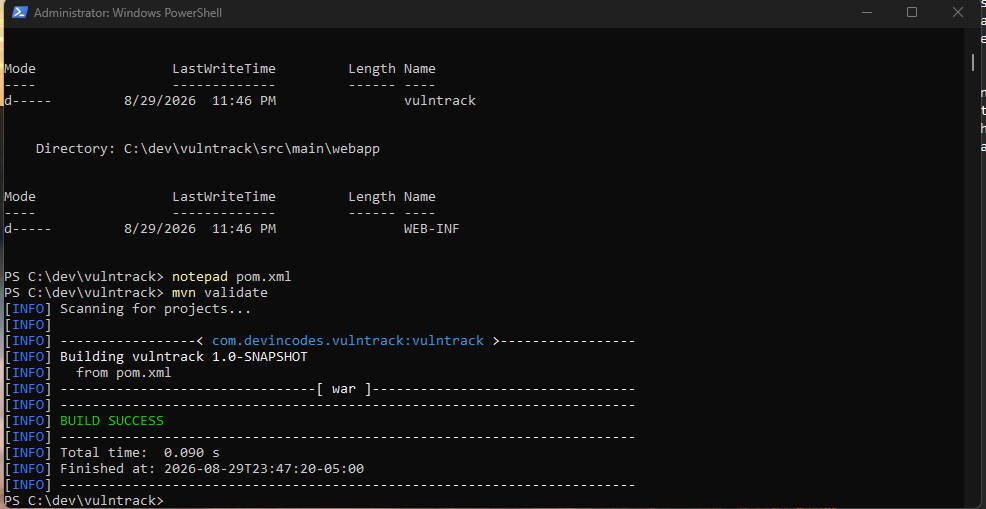
*The first clean `mvn validate` after hand-writing the Maven configuration*

That led to the first real milestone: WildFly running in Docker, serving a
REST endpoint end to end.

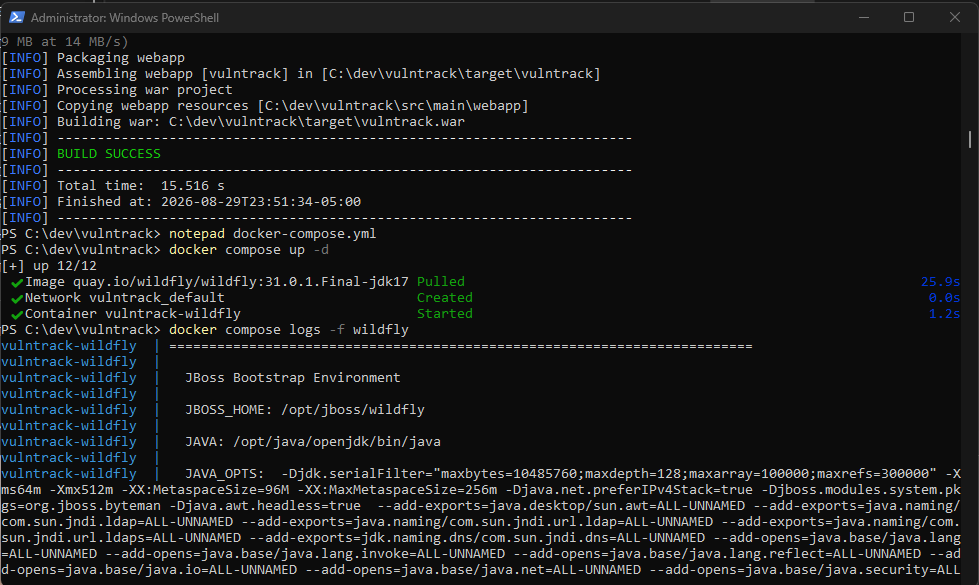

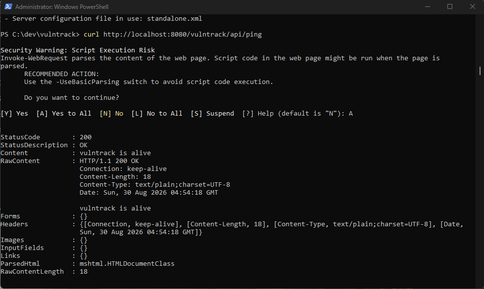
*Maven → WAR → WildFly → REST, working end to end for the first time*

---

## Data model

Four core entities: `Asset`, `Vulnerability`, `Finding` (the join entity
linking a vulnerability to an asset with a status and remediation
deadline), and `AppUser`.

PostgreSQL runs as its own container/RDS instance with a **hand-installed
JDBC driver module** — WildFly doesn't ship one — configured via a CLI
script that runs during the Docker image build:

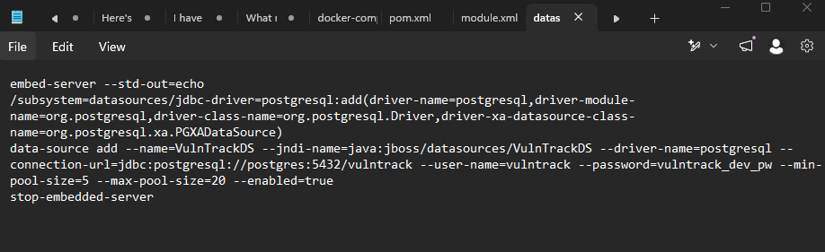
*Registers the PostgreSQL driver and creates the `VulnTrackDS` datasource,
using `${env.VAR:default}` expressions so the same image works unchanged
across local Docker Compose, ECS, and EKS*

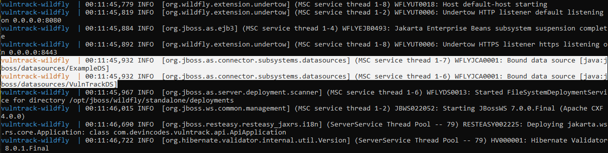
*WildFly's default `ExampleDS` alongside the custom `VulnTrackDS`*

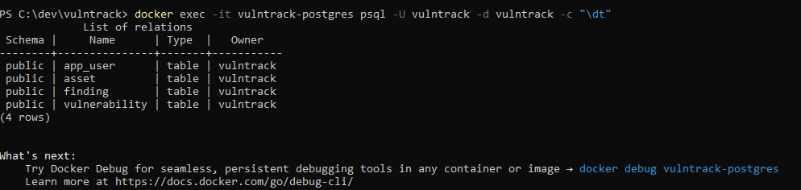
*Hibernate mapped all four JPA entities to real Postgres tables*

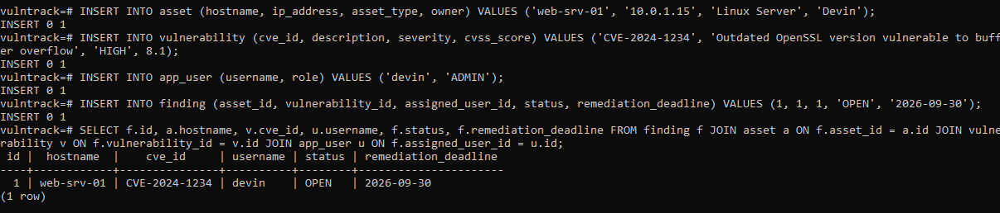
*A single SQL join across all four tables — the clearest proof the
relational model is correct, not just that the tables exist*

---

## API reference

Base path: `/vulntrack/api`

| Method | Endpoint | Auth required | Notes |
|---|---|---|---|
| POST | `/auth/register` | No | Creates a user (bcrypt-hashed password) |
| POST | `/auth/login` | No | Returns a signed JWT (1-hour expiry) |
| GET | `/assets` | Yes | List all assets |
| GET | `/assets/{id}` | Yes | Get one asset |
| POST | `/assets` | Yes | Create an asset |
| PUT | `/assets/{id}` | Yes | Update an asset |
| DELETE | `/assets/{id}` | Yes (**ADMIN only**) | Delete an asset |
| GET / POST / PUT / DELETE | `/vulnerabilities`, `/vulnerabilities/{id}` | Yes | Same CRUD pattern |
| GET / POST / PUT / DELETE | `/users`, `/users/{id}` | Yes | Same CRUD pattern |
| GET / POST / PUT / DELETE | `/findings`, `/findings/{id}` | Yes | Accepts `assetId` / `vulnerabilityId` / `assignedUserId` in the request body; the server resolves the actual entities |

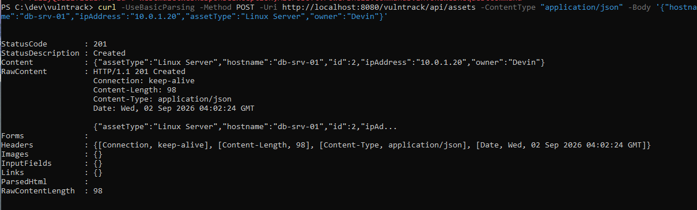
*`201 Created` confirming the full write path — REST → JPA → Postgres*

---

## Authentication & authorization

- Passwords are hashed with bcrypt before storage — never stored plain
- `POST /auth/login` returns a JWT signed with HS384, containing the
  username (`sub`) and role (`role`) claims
- A `ContainerRequestFilter` (`AuthFilter`) validates the
  `Authorization: Bearer <token>` header on every request except
  `/auth/*` and the health-check endpoint `/ping`
- Role checks are enforced per-endpoint using a `@RequestScoped` CDI bean
  (`RequestUserContext`) shared between the filter and the resource
  classes — a CDI-proxied JAX-RS resource can't reliably inject
  `ContainerRequestContext` directly, so this bean bridges the filter and
  the resource cleanly (see [Troubleshooting log](#troubleshooting-log--lessons-learned))
- Example: `DELETE /assets/{id}` is restricted to `ADMIN`; `ANALYST` users
  get `403 Forbidden`

Verified against a **live AWS deployment**, not just locally:

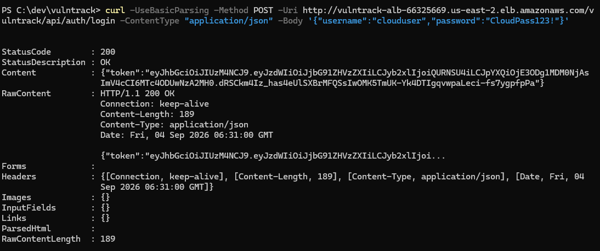
*A real JWT issued by the production deployment*

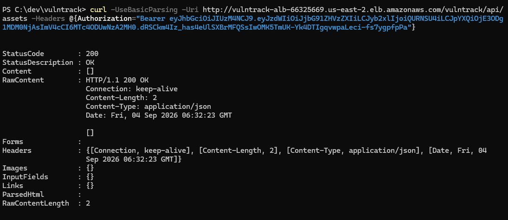
*The same token used to call a protected endpoint — `200 OK`, proving the
full auth chain works against RDS in the real environment*

> **Note on the JWT signing key**: `JwtUtil.java` reads `JWT_SIGNING_KEY`
> from the environment (injected from Secrets Manager in both the ECS and
> EKS deployments), falling back to a clearly-commented dev-only value
> when that variable isn't set — so local Docker Compose runs need no
> configuration at all.

---

## Infrastructure as code

The AWS environment — VPC, security groups, RDS, compute, load balancer,
Secrets Manager — is fully defined in Terraform, in **two independent
root modules**:

- [`terraform-ecs/`](terraform-ecs/) — the original Phase 4 build: ECS
  Fargate, ALB with ACM, Secrets Manager
- [`terraform-eks/`](terraform-eks/) — the Phase 5 rebuild: EKS, IRSA
  roles for every mesh/DNS/cert component, RDS, WAF, EKS access entries

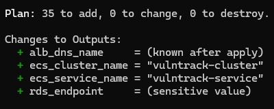
*Reviewing exactly what will be created before committing to it*

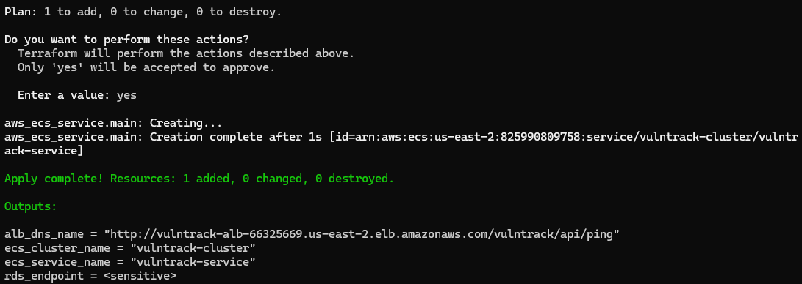
*`Apply complete!` — real AWS infrastructure, built entirely from code*

Neither environment is left running continuously — RDS, NAT gateways, and
EKS's control plane all carry real hourly cost. `terraform destroy` tears
everything down cleanly; `terraform apply` rebuilds it — and
[Phase 6](#phase-6-proving-the-rebuild) documents exactly what that took
in practice. State for `terraform-eks/` lives in a versioned S3 bucket
with native S3 locking. IAM
identities, the ECR repository, and the GitHub OIDC provider are shared
infrastructure outside either Terraform module and persist across
destroy/apply cycles for both.

---

## Phase 5: Kubernetes, a service mesh, and real TLS automation

Phase 4 proved the application worked well on serverless containers.
Phase 5 asks a different question: what does the same application look
like on a real, self-managed Kubernetes cluster, with a service mesh
providing pod-to-pod encryption and a fully automated DNS/TLS chain?

### Reorganizing for two architectures

The existing ECS Terraform config was moved into its own folder before
any EKS work began, so neither build could interfere with the other:

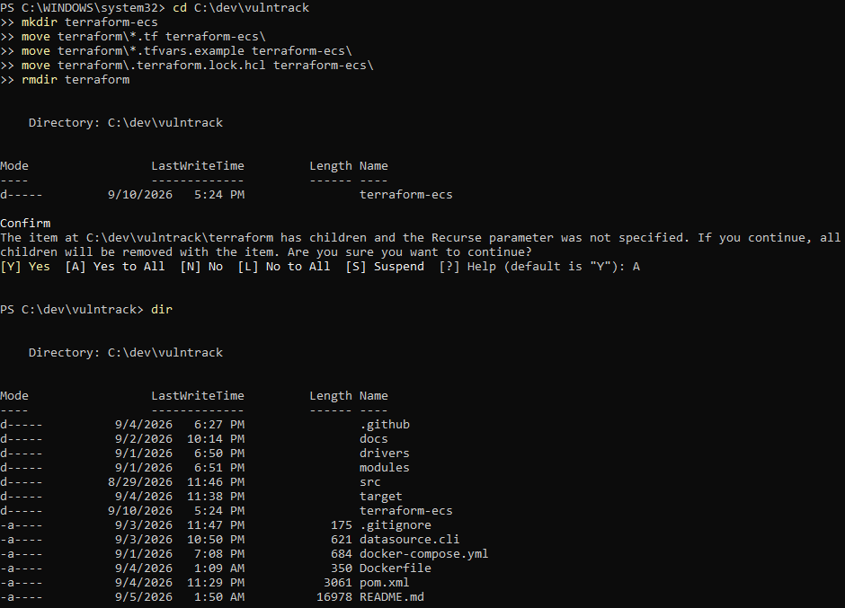

### Domain and DNS delegation

`vulntrack.app` was registered through Cloudflare — and Cloudflare's
registrar terms **contractually require using Cloudflare's own
nameservers**, which blocks the planned Route53 integration outright (not
a missing feature — an explicit registrar policy). Rather than wait out
the mandatory 60-day ICANN transfer lock, DNS was delegated one level
down: a Route53 hosted zone was created for `aws.vulntrack.app`
specifically, and Cloudflare was given an `NS` record pointing that one
subdomain at Route53. Everything under `aws.vulntrack.app` is fully
Route53-managed; the root domain stays with Cloudflare.

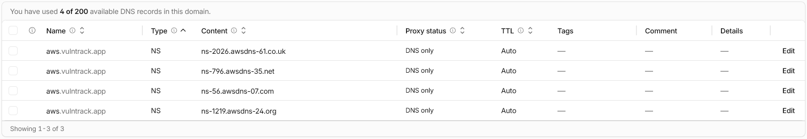
*Four Route53 nameservers registered as an NS record for the `aws`
subdomain — delegation confirmed working within minutes*

### The EKS cluster

A dedicated VPC, an EKS control plane, and a managed EC2 node group —
deliberately **not** Fargate profiles, since Istio's sidecar networking
requires `iptables` manipulation that Fargate doesn't support.

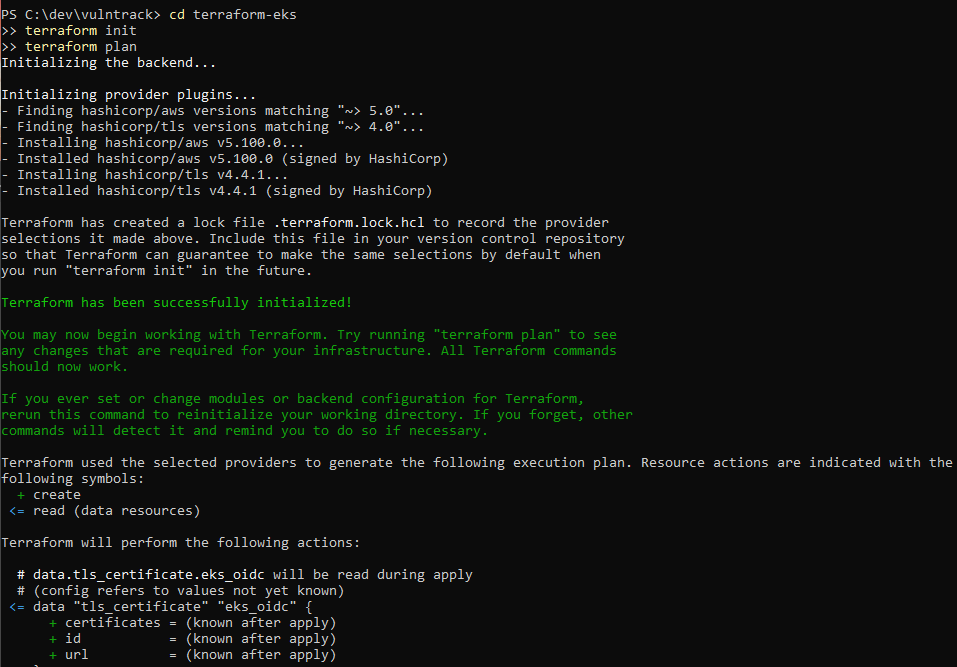

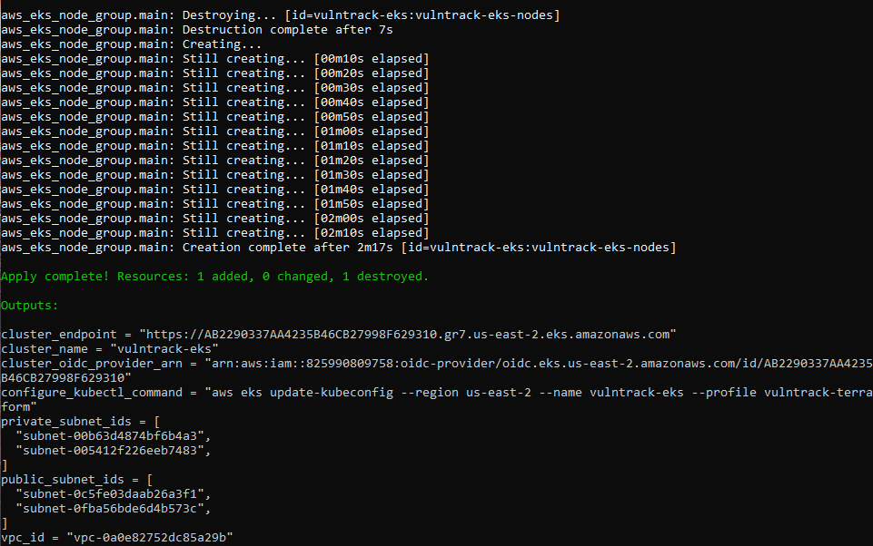

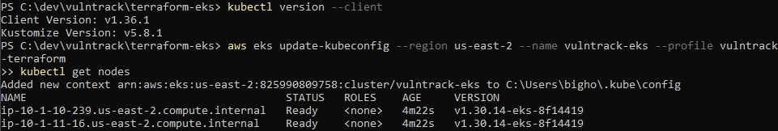

The AWS Load Balancer Controller was installed via Helm shortly after —
this is what lets a Kubernetes `Ingress` resource provision a real ALB:

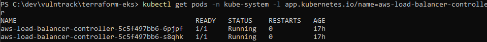

### The pod-density ceiling (and the proper fix)

Once cert-manager and the Istio control plane were added, pods started
getting stuck `Pending` even with spare CPU/memory showing on every node:

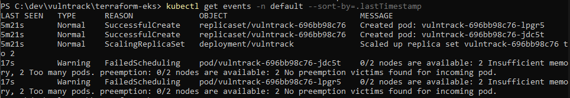

The real cause: `t3.micro`'s network interfaces can only hand out **4 pod
IPs per node**, a hard ceiling completely unrelated to CPU or RAM. A quick
node-count increase unblocked things temporarily —

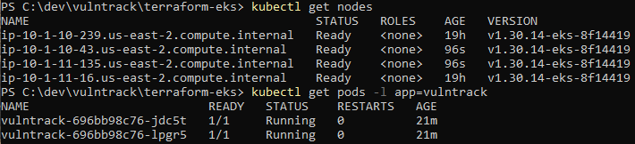

— but with Istio about to inject a sidecar into every pod (roughly
doubling pod count), that was only ever a stopgap. The actual fix: enable
**VPC CNI prefix delegation** and a custom node-group launch template
overriding `kubelet`'s `maxPods`, raising per-node capacity from 4 to 30:

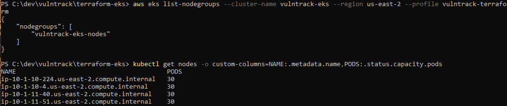
*Three independent sources — Terraform state, the AWS API, and
`kubectl` itself — all agreeing the fix genuinely worked*

Getting the fix in required two IAM permissions no prior phase had ever
needed (`ec2:CreateLaunchTemplate`, and separately `ec2:RunInstances` —
EKS validates the *calling user's* launch-template permissions before
delegating the actual launch to its own service role) — see the
[Troubleshooting log](#troubleshooting-log--lessons-learned) for the full
diagnostic path.

### Ingress, TLS, and WAF

A Kubernetes `Ingress` resource triggers the Load Balancer Controller to
provision a real ALB:

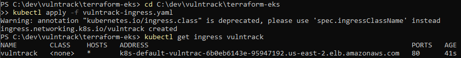

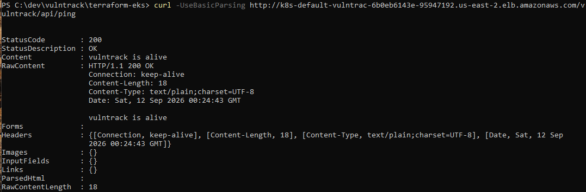

**TLS**: ALB's HTTPS listener only accepts ACM (or IAM-uploaded)
certificates natively — it has no way to reference a `cert-manager`
Secret directly. So the real certificate is issued by **Let's Encrypt**
via `cert-manager`, using a DNS-01 challenge solved automatically through
Route53 (an IRSA role scoped to exactly the `aws.vulntrack.app` hosted
zone, nothing else):

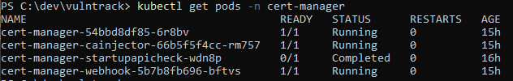

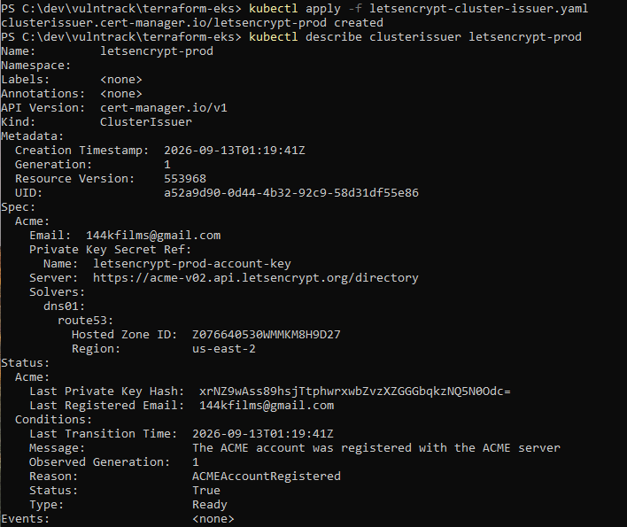

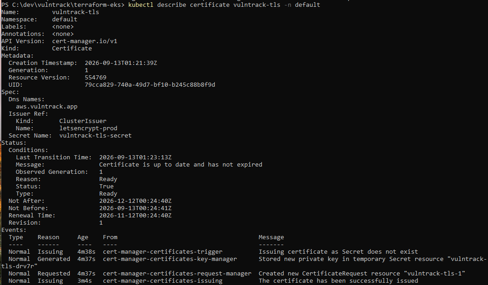
*A real, valid certificate — issued, not self-signed, with normal 90-day
Let's Encrypt expiry and cert-manager auto-renewal*

That certificate is then **manually bridged into ACM** — extracting the
cert/key from the Kubernetes Secret cert-manager creates, splitting the
leaf certificate from its intermediate chain (Let's Encrypt returns them
concatenated; ACM's API wants them separate), and importing the result:

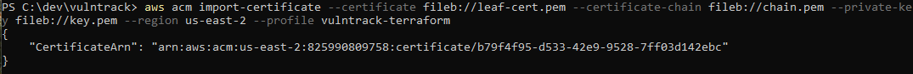

> This bridge is a **manual, non-auto-renewing step** — a known,
> documented tradeoff of choosing Let's Encrypt specifically to
> demonstrate `cert-manager` skills, rather than just using ACM's own
> (free, auto-renewing) certificates directly. A production setup would
> automate the re-import on every 90-day renewal.

**DNS**: rather than a static Terraform record (which would go stale the
moment the ALB is recreated), **ExternalDNS** watches the Ingress and
manages the Route53 record automatically:

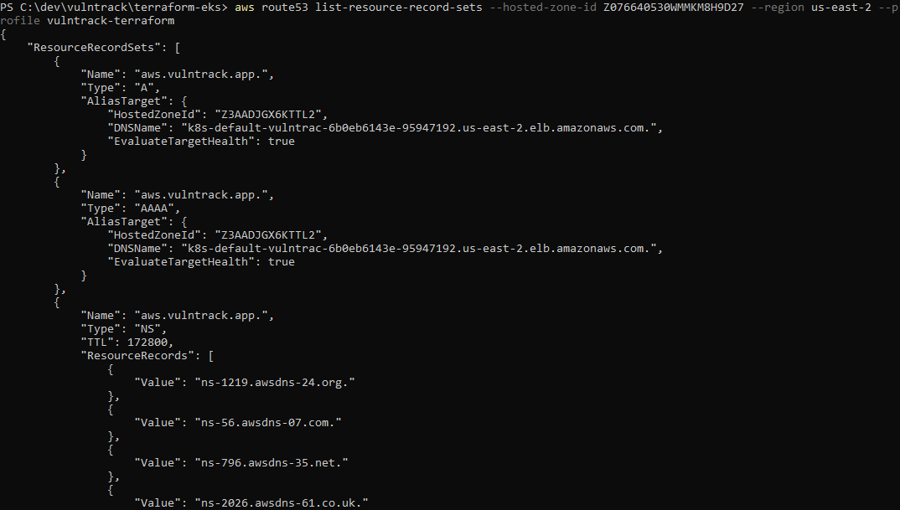

**WAF**: an AWS WAFv2 Web ACL — three AWS-managed rule groups (common
exploits, known bad inputs, and SQL injection specifically, a fitting
choice for a vulnerability tracker) plus IP-based rate limiting — attached
directly to the ALB (originally through a Terraform association; moved to
an Ingress annotation in [Phase 6](#phase-6-proving-the-rebuild)):

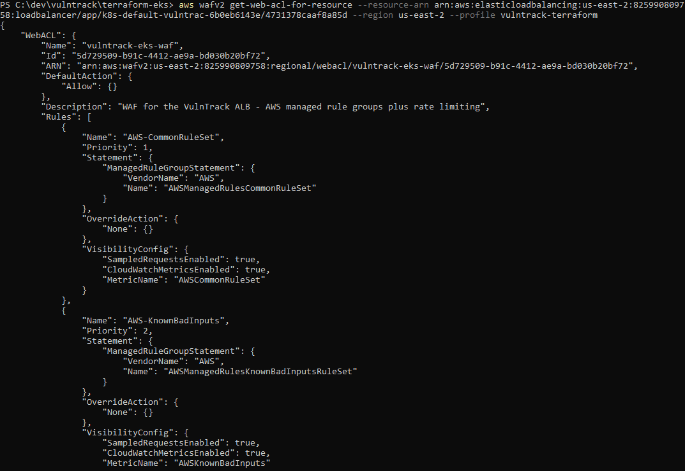

All of it working together, live, over real HTTPS, on the actual domain:

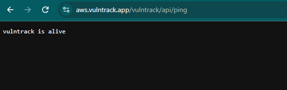

### The service mesh: Istio with STRICT mTLS

Istio was installed via Helm — control plane (`istiod`), then a dedicated
**Istio Ingress Gateway** sitting between the ALB and the app (so the ALB
still does TLS termination and WAF, but everything past that point is
mesh-native and can enforce real mTLS):

```
 ALB (TLS + WAF) ──plaintext──> Istio Ingress Gateway ──mTLS──> VulnTrack pod + Envoy sidecar
```

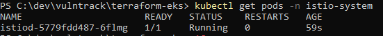

Istio's default control-plane resource requests (2Gi memory for `istiod`
alone) exceed a single `t3.micro`'s *entire* RAM — not a "needs more
nodes" problem, since no number of 1GB nodes can satisfy a pod that needs
2GB on one node. Resolved by overriding `istiod` and the gateway's
resource requests down to values that actually fit — a legitimate,
explained tradeoff for a cost-constrained demo environment, not something
a real production cluster would do.

The gateway rewire itself happened **without taking the live site down**:

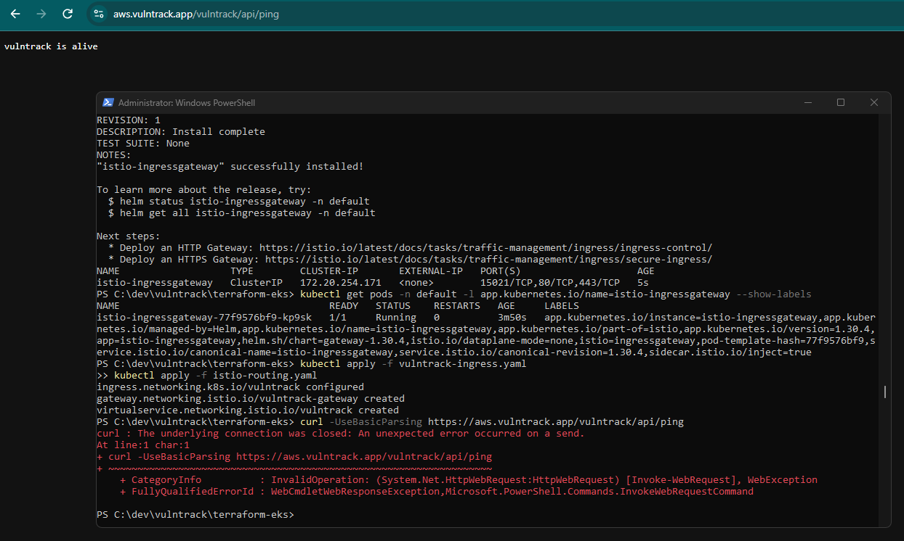

Enabling sidecar injection and restarting the app confirmed both
containers per pod — the app, and its injected Envoy proxy:

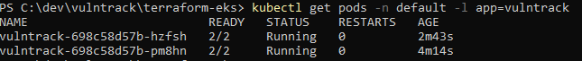

That injection alone reintroduced the pod-density problem from a second
angle: the sidecar's *own* default resource requests, combined with the
app's, exceeded what a single `t3.micro` node could satisfy for even one
pod — a real, concrete number (~640Mi combined, against roughly ~600–700Mi
of actually-usable memory per node). Fixed by right-sizing both the app's
request and the sidecar's request via `sidecar.istio.io/proxyMemory`
overrides, rather than continuing to add nodes indefinitely.

Finally, a `PeerAuthentication` policy enforcing **STRICT** mTLS —
scoped specifically to the `vulntrack` app pods, not the whole namespace,
since the Ingress Gateway (which legitimately receives plaintext from the
non-mesh ALB) also lived there at the time. (The gateway has since moved
to `istio-system` — see [Phase 6](#phase-6-proving-the-rebuild) — and the
pod-scoped selector remains the right design either way.)

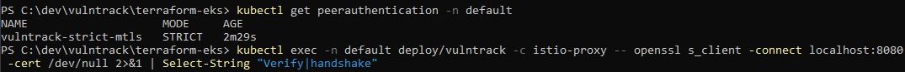

The strongest proof STRICT mode is genuinely enforcing encryption: a
misconfigured STRICT policy simply refuses non-mTLS connections outright
— so the fact that the site kept responding normally after this policy
was applied *is itself* the confirmation that Gateway → Pod traffic is
real, encrypted mTLS.

### Re-pointing CI/CD at EKS

The existing GitHub Actions pipeline (Phase 4) deployed to ECS — which no
longer exists once EKS became the active environment. Redirecting it
required two separate, easy-to-miss pieces beyond just editing the
workflow file:

1. **AWS-level IAM permissions** (`eks:DescribeCluster`, so
   `aws eks update-kubeconfig` can even find the cluster)
2. **Kubernetes-level RBAC access** via an **EKS access entry** — AWS IAM
   permissions and in-cluster Kubernetes permissions are two entirely
   separate authorization systems, and having one grants nothing in the
   other

The access entry is scoped to `edit` permissions in the `default`
namespace only — enough to restart a deployment, nowhere near
cluster-admin.

While reviewing the Terraform plan for this change, a subtle mistake
would have **destroyed and recreated the entire EKS cluster** — adding an
`access_config` block without also specifying
`bootstrap_cluster_creator_admin_permissions` (a create-time-only
attribute) made Terraform think that value needed to change, which forces
full cluster replacement. Caught by reading the plan output line-by-line
before applying, rather than trusting the summary — full story in the
[Troubleshooting log](#troubleshooting-log--lessons-learned).

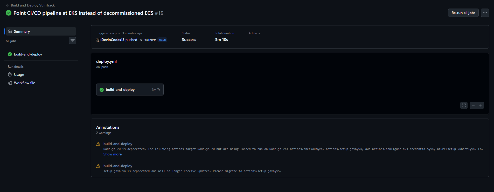
*Build → push to ECR → authenticate via OIDC → connect to EKS → rollout
restart, all green on the very first run against the newly-wired access
entry*

---

## Phase 6: Proving the rebuild

The [Infrastructure as code](#infrastructure-as-code) section makes a
claim: `terraform destroy` tears everything down, and `terraform apply`
rebuilds it. Phase 6 tested that claim for real — a brand-new development
machine, an empty state file, and a rebuild of the entire Phase 5 stack
from nothing — and wrote down every place the claim turned out not to
hold. Nine separate problems surfaced, and **none of them could have been
found any other way**: each one only exists on the path from zero to live.

### A development environment defined in code

Development moved off the Windows host entirely and into a Fedora VM
defined by a [`Vagrantfile`](vagrant/Vagrantfile) and a
[`provision.sh`](vagrant/provision.sh) — Java, Maven, Docker, Terraform,
kubectl, Helm, and the AWS CLI, all installed unattended. Code is edited
from VS Code on the host over **Remote-SSH**; the source tree, the build,
and every CLI tool live inside the box. Setup details are in
[`vagrant/README.md`](vagrant/README.md).

Two deliberate choices shaped it:

- **Vagrant runs on the Windows host, not inside another VM.** VirtualBox
  inside VirtualBox isn't supported, so the box sits alongside the lab
  VMs rather than nested in one.
- **The base box is pulled straight from Fedora's own mirror with a
  pinned SHA-256 checksum**, rather than by name from HashiCorp's hosted
  box registry — which is being wound down, and which a dev environment
  meant to be rebuilt later shouldn't depend on.

The first real problem was Java. Fedora 44 no longer ships a JDK 17
package, and installing Maven quietly pulls in JDK 25 as a dependency:

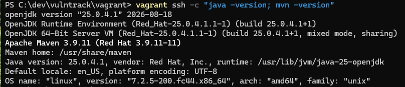

The build still succeeded — the pom's `<release>17</release>` makes JDK 25
compile against the Java 17 API —

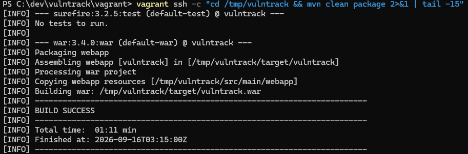

— but the app deploys onto `wildfly:31.0.1.Final-jdk17`, and building on
one JDK while running on another is exactly the drift a reproducible
environment exists to prevent. Installing Temurin 17 from Adoptium wasn't
enough on its own: Fedora derives `alternatives` priority from the version
string, so JDK 25 registers at **25000421**, and no sensible priority
outranks it:

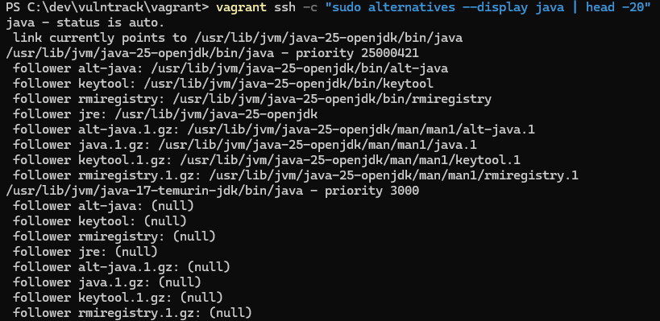

Fixed by pinning the selection with `alternatives --set` instead of
fighting the priority number — which also means a future `dnf upgrade`
that brings in JDK 26 can't silently reclaim the default:

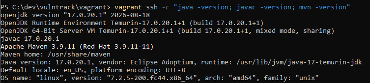

The real test of a provisioning script is deleting the machine and
running it again with no hand-fixing. `vagrant destroy` then `vagrant up`:

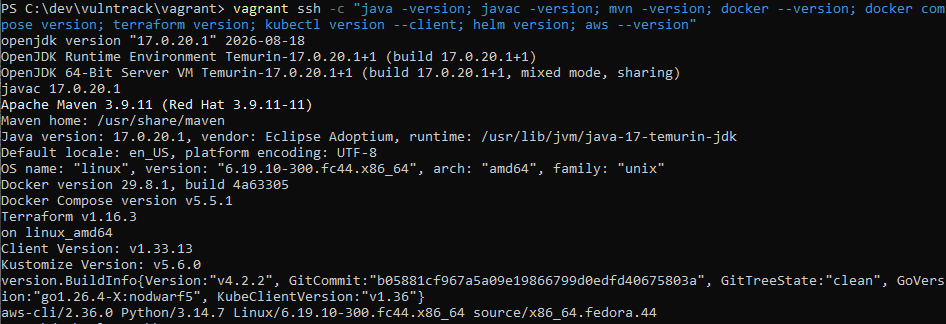
*Every tool reporting correctly on a box built from nothing but two files.
(Note the kubectl v1.33 client — two minor versions ahead of the cluster,
caught and pinned to v1.31 later in the rebuild.)*

Then the day-to-day workflow — VS Code attached to the box, building and
running the local stack inside it:

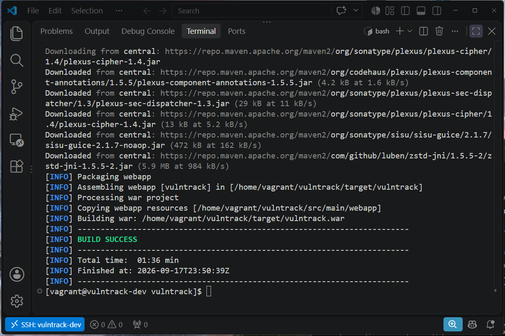

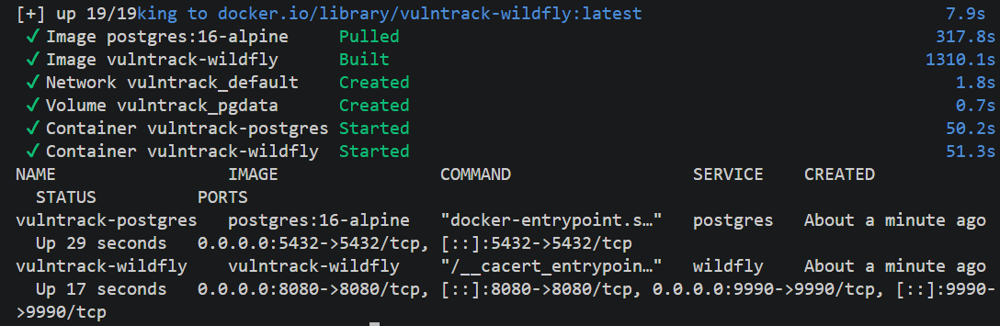

### Recovering from local state

Before moving machines, the Terraform state had to be found — and the
search turned up a problem. State had always been a **local, unversioned
file**. The live `terraform.tfstate` was 183 bytes: an empty shell, zero
resources, at serial 143. The only record of what the stack had contained
was the `.backup` file beside it — 44 resources, at serial 95.

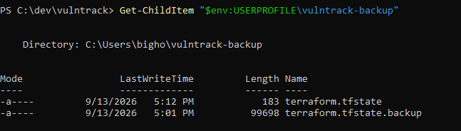

The serial numbers explain it. Terraform writes `.backup` once, at the
start of a run, then increments the serial on every state write after
that — and 143 − 95 = 48 writes, for 44 resources plus overhead. That's
the signature of a `terraform destroy` that ran to completion, not a
corrupted file. Still, the state is a claim about AWS, not proof of it,
so AWS was asked directly: no EKS or ECS clusters, no running instances,
no RDS, no load balancers, no NAT gateways, and no secrets sitting in a
pending-deletion window. Nothing orphaned, nothing billing.

One local file had been one `destroy` away from being the only
description of the infrastructure. `terraform-eks/` now keeps its state
in S3:

```hcl
terraform {
  backend "s3" {
    bucket       = "vulntrack-tfstate-825990809758"
    key          = "eks/terraform.tfstate"
    region       = "us-east-2"
    encrypt      = true
    use_lockfile = true
    profile      = "vulntrack-terraform"
  }
}
```

The bucket has **versioning on** (so an emptied state is recoverable from
a prior version), public access fully blocked, and encryption at rest —
state files hold database credentials and secret values in plaintext.
Locking uses Terraform's native S3 lockfile rather than the older
DynamoDB lock table.

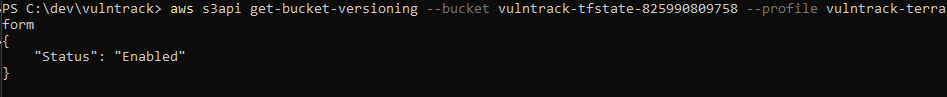

Two things broke on the way, both documented in the
[Troubleshooting log](#troubleshooting-log--lessons-learned): the
least-privilege Terraform IAM user had never been granted any S3
permissions, and the backend quietly authenticated as the **wrong IAM
user** — because backend blocks can't read variables, so the provider's
`var.aws_profile` never applied to it.

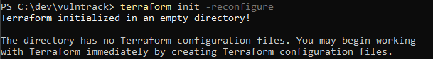

### The rebuild, and what it surfaced

`terraform apply` built 46 resources and failed on exactly one. After two
fixes, the plan came back clean against live infrastructure:

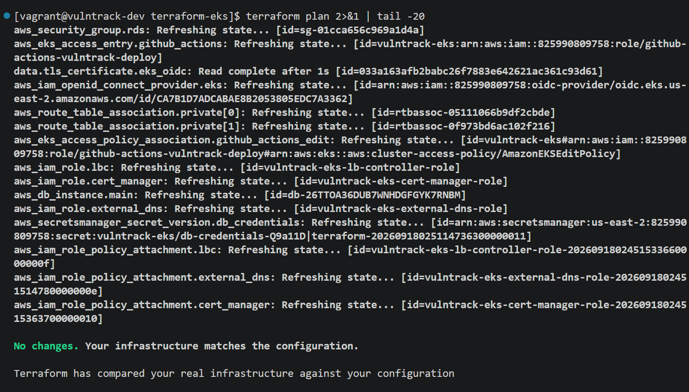

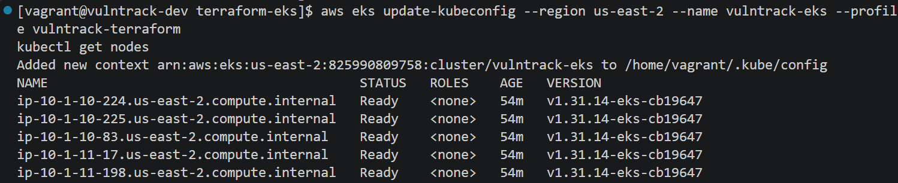

Everything between "`Apply complete!`" and a working site was where the
real problems were:

| # | What broke | Why only a rebuild exposes it | Fix |
|---|---|---|---|
| 1 | WAF association failed: `WAFNonexistentItemException` | Terraform held the old ALB's ARN as a hardcoded default. The Load Balancer Controller creates a new ALB — new ARN — every time the Ingress is recreated | Attach the Web ACL with the `alb.ingress.kubernetes.io/wafv2-acl-arn` Ingress annotation, so it follows whatever ALB exists |
| 2 | Node group showed a change on every single plan | Launch template version was the string `$Latest`; AWS stores the resolved number (`1`), so they never match | Reference `aws_launch_template.eks_nodes.latest_version` |
| 3 | kubectl v1.33 against a v1.31 cluster — outside the supported ±1 skew | The new dev box installed whatever kubectl was current; nothing tied the client version to the cluster's | Pin the Kubernetes package repo to v1.31 in `provision.sh` |
| 4 | Pods stuck `ContainerCreating`: `failed to assign an IP address` | Phase 5's `maxPods: 30` lived in the Terraform launch template and came back. VPC CNI prefix delegation had been set with `kubectl` — not in code — and didn't. Nodes **advertised** 30 pod slots they couldn't give IPs to | Re-enabled prefix delegation on the `aws-node` DaemonSet; moving it into Terraform is on the roadmap |
| 5 | Second app replica unschedulable: `Insufficient memory` on all five nodes | With every controller freshly scheduled, no node had room for a second ~450Mi app-plus-sidecar pod — each `t3.micro` exposes only ~520Mi of allocatable memory | `replicas: 1` — the honest ceiling of 1 GiB free-tier nodes carrying a service mesh |
| 6 | ALB returned `503 Backend service does not exist` | The Helm install commands were never in the repo — only their values files. The Istio gateway came back up in `istio-system` instead of `default`, and an Ingress can't reference a Service in another namespace | Moved the Ingress into `istio-system`; health check pointed at the gateway's own status port (`15021`, `/healthz/ready`) |
| 7 | DNS stayed pointed at a deleted ALB | ExternalDNS had never written its TXT ownership records for the zone-apex name — not in Phase 5 either — so it refused to update or delete records it couldn't prove were its own | `txtPrefix: "extdns-%{record_type}."`, then cleared the orphaned records once so it could recreate them with ownership |
| 8 | App pods couldn't start: missing `vulntrack-secrets` | The Kubernetes Secret was created by hand in Phase 5 and never written down | Rebuilt from Secrets Manager; the procedure is now in the runbook below |
| 9 | Backend `403` despite correct permissions | Backends can't use variables, so authentication fell through to the default AWS profile | Literal `profile` in `backend.tf` |

Two things came through intact **because** they sit outside the
Terraform lifecycle: the Route53 hosted zone (read with a data source, so
the Cloudflare NS delegation never had to change) and the ACM-imported
certificate.

Items 1, 6, and 7 are the same lesson from three directions: anything that
records the identity of something the cluster creates — an ALB's ARN, a
Service's namespace, a DNS record's owner — breaks the moment that thing
is recreated. The fixes all move the reference to the component that owns
the lifecycle.

The WAF fix, verified against the ALB that exists now rather than the one
that used to:

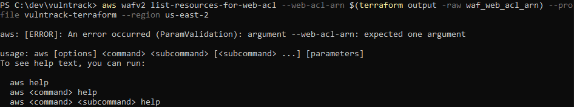

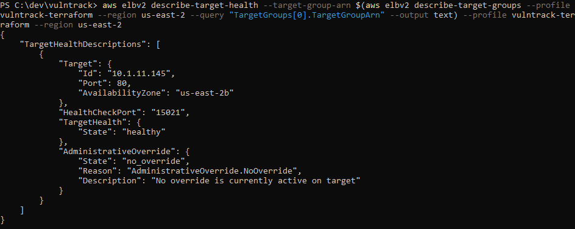

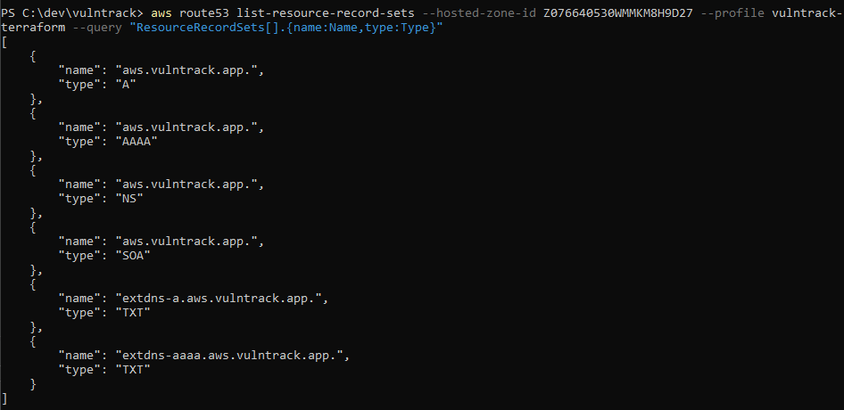
*A and AAAA at the apex, and — for the first time in this project's
history — the TXT records that let ExternalDNS actually own them*

And back where it started:

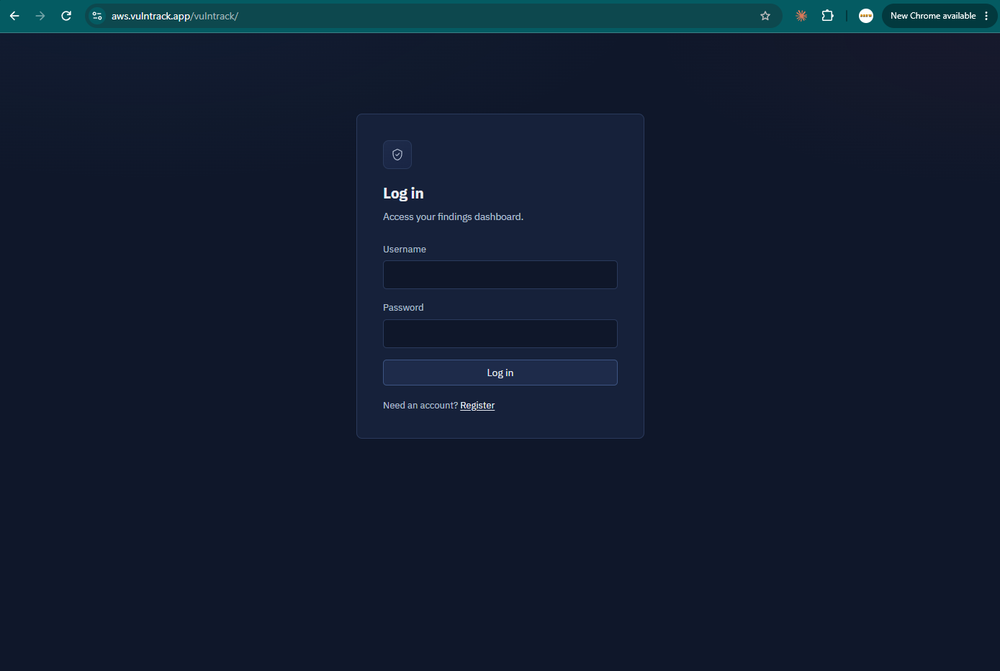
*`aws.vulntrack.app`, rebuilt from an empty state file on a dev machine
that didn't exist a week earlier*

### Rebuild runbook

Everything between `terraform apply` and a live site, in order, as it
actually worked. Run from `terraform-eks/` inside the dev box.

```bash
# 1. Infrastructure
terraform init
terraform apply
aws eks update-kubeconfig --region us-east-2 --name vulntrack-eks --profile vulntrack-terraform

# 2. VPC CNI prefix delegation (not yet in Terraform — without it,
#    nodes advertise 30 pod slots but can only assign ~4 IPs)
kubectl -n kube-system set env daemonset aws-node ENABLE_PREFIX_DELEGATION=true WARM_PREFIX_TARGET=1
kubectl -n kube-system rollout status daemonset aws-node

# 3. Helm chart repos, then the AWS Load Balancer Controller
helm repo add eks https://aws.github.io/eks-charts
helm repo add external-dns https://kubernetes-sigs.github.io/external-dns
helm repo add jetstack https://charts.jetstack.io
helm repo add istio https://istio-release.storage.googleapis.com/charts
helm repo update
kubectl apply -f lbc-service-account.yaml
helm install aws-load-balancer-controller eks/aws-load-balancer-controller -n kube-system \
  --set clusterName=vulntrack-eks --set serviceAccount.create=false \
  --set serviceAccount.name=aws-load-balancer-controller \
  --set region=us-east-2 --set vpcId=$(terraform output -raw vpc_id)

# 4. ExternalDNS
helm install external-dns external-dns/external-dns -n kube-system -f external-dns-values.yaml

# 5. cert-manager + Let's Encrypt issuer
helm install cert-manager jetstack/cert-manager -n cert-manager --create-namespace \
  --set crds.enabled=true --set startupapicheck.enabled=false \
  --set "serviceAccount.annotations.eks\.amazonaws\.com/role-arn=$(terraform output -raw cert_manager_role_arn)"
kubectl apply -f letsencrypt-cluster-issuer.yaml

# 6. Istio (the gateway goes in istio-system — the Ingress depends on it)
helm install istio-base istio/base -n istio-system --create-namespace
helm install istiod istio/istiod -n istio-system -f istiod-values.yaml --wait
helm install istio-ingressgateway istio/gateway -n istio-system -f istio-gateway-values.yaml
kubectl label namespace default istio-injection=enabled

# 7. App secret, built from Secrets Manager
CREDS=$(aws secretsmanager get-secret-value --secret-id vulntrack-eks/db-credentials \
  --profile vulntrack-terraform --region us-east-2 --query SecretString --output text)
JWT=$(aws secretsmanager get-secret-value --secret-id vulntrack-eks/jwt-signing-key \
  --profile vulntrack-terraform --region us-east-2 --query SecretString --output text)
kubectl create secret generic vulntrack-secrets \
  --from-literal=DB_HOST="$(echo "$CREDS" | jq -r .host)" \
  --from-literal=DB_PORT="$(echo "$CREDS" | jq -r .port)" \
  --from-literal=DB_NAME="$(echo "$CREDS" | jq -r .dbname)" \
  --from-literal=DB_USERNAME="$(echo "$CREDS" | jq -r .username)" \
  --from-literal=DB_PASSWORD="$(echo "$CREDS" | jq -r .password)" \
  --from-literal=JWT_SIGNING_KEY="$JWT"

# 8. App, mesh policy, and — last — the Ingress, which creates the ALB
kubectl apply -f vulntrack-deployment.yaml -f vulntrack-service.yaml
kubectl apply -f vulntrack-certificate.yaml -f istio-routing.yaml -f peer-authentication.yaml
kubectl apply -f vulntrack-ingress.yaml
```

Checks worth running before calling it done: pods show `2/2` (sidecar
injected), the ALB target is `healthy`, the Route53 zone has `extdns-`
TXT records alongside A/AAAA, and the WAF lists the *current* ALB.

> **Note:** `vulntrack-ingress.yaml` references the ACM certificate by
> ARN. That certificate is imported (see Phase 5's manual Let's Encrypt →
> ACM bridge) and lives outside Terraform, so it survives a destroy — but
> it also has to be re-imported before it expires.

---

## Phase 7: Hardening what was already running

Phases 1 through 6 built the thing and proved it could be rebuilt. Phase 7
asks a different question: of the data this application holds and the
traffic it accepts, what is actually protected, and how would anyone know?

The honest starting answer was "less than the architecture diagram
suggests." The database was unencrypted. Node disks were unencrypted. The
Terraform state bucket — which holds the database password and the JWT
signing key in plaintext — was encrypted with an AWS-owned key that cannot
be audited. The container image was built on an operating system that had
been end-of-life for over a year. Audit logging was running and recording
nothing.

Every one of those passes a casual look. Each section below is one of them.

### A key you actually control

AWS encrypts EBS and RDS by default, with keys it owns and manages. The
data is encrypted, but the key is opaque: its use cannot be audited per
call, it cannot be rotated on demand, and it cannot be revoked. A
customer-managed key changes all three — every `Encrypt`/`Decrypt` appears
in CloudTrail, rotation is a setting, and disabling the key makes
everything encrypted with it immediately unreadable.

[`kms.tf`](terraform-eks/kms.tf) creates one with annual rotation and a
seven-day deletion window:

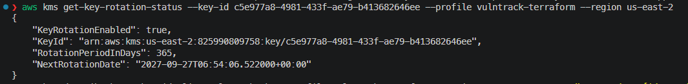
*`KeyManager: CUSTOMER` is the part that matters — an AWS-managed key would
say `AWS` and offer none of the above*

Pointing the node group's launch template at it was a two-line change.
Applying it was not, because **a KMS key being enabled and a service being
able to use it are different things**. The node group update failed with:

```
Client.InvalidKMSKey.InvalidState: The KMS key provided is in an incorrect state
```

The key was enabled and healthy. What the message meant was that the Auto
Scaling service-linked role had no permission to use it. A KMS key carries
its own resource policy, separate from IAM, and **both** must allow an
action — the default policy names only the account root, so no IAM grant
can substitute. Adding `kms:Encrypt`, `kms:GenerateDataKey*` and a
conditioned `kms:CreateGrant` for
`AWSServiceRoleForAutoScaling` fixed it, and the rolling replacement
completed on the next attempt.

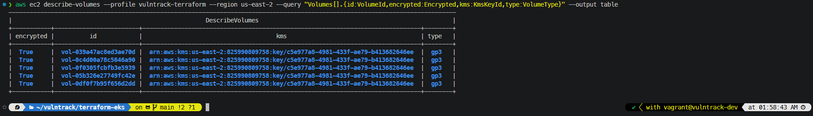
*Five nodes, `gp3`, every volume encrypted with the project's own key*

### Encrypting a database that was already running

RDS cannot encrypt storage in place. Encryption is decided when the
storage is created, so the only path for an existing instance is:

```
snapshot → copy the snapshot with the CMK → restore a new instance from the copy
```

Steps one to three run against the live database with no downtime. The
only interruption is repointing the application, which is one value in a
Kubernetes Secret and a pod restart:

```bash
aws rds create-db-snapshot      --db-instance-identifier vulntrack-eks-db ...
aws rds copy-db-snapshot        --kms-key-id alias/vulntrack-eks ...
aws rds restore-db-instance-from-db-snapshot --no-publicly-accessible ...
kubectl patch secret vulntrack-secrets -p "{\"data\":{\"DB_HOST\":\"$(echo -n "$NEWHOST" | base64 -w0)\"}}"
kubectl rollout restart deployment vulntrack
```

`--no-publicly-accessible` is not optional: a restore defaults to
**public**, which would put the database on the internet.

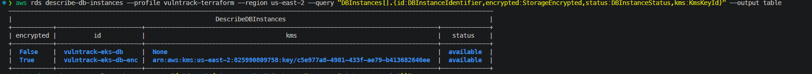
*The same data, before and after — the restored instance keeps the
original credentials, so only the hostname changes*

The step that is easy to skip is the one that matters most afterward.
Terraform still tracked the *old* instance, and because that instance still
existed and still matched the configuration, `terraform plan` reported
**"No changes"** — the dangerous answer, not the reassuring one. Deleting
the old database at that point would have left Terraform convinced a
resource was missing and ready to recreate it: a fresh, empty,
**unencrypted** database, while the real one sat unmanaged.

Reconciling it meant updating the config to describe what exists, then
swapping the state entry:

```bash
terraform state rm aws_db_instance.main          # stop tracking the old one (does not delete it)
terraform import aws_db_instance.main vulntrack-eks-db-enc
```

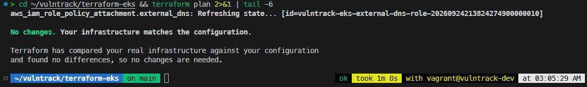

### The bucket holding every secret

The Terraform state file contains the RDS password and the JWT signing key
in plaintext. Public access was already blocked and versioning already on
(both from the Phase 6 migration), but the bucket was encrypted with
`AES256` — SSE-S3, an AWS-owned key — and had **no bucket policy at all**,
so nothing prevented a plaintext HTTP request.

[`s3-state-hardening.tf`](terraform-eks/s3-state-hardening.tf) switches it
to the customer-managed key and denies insecure transport:

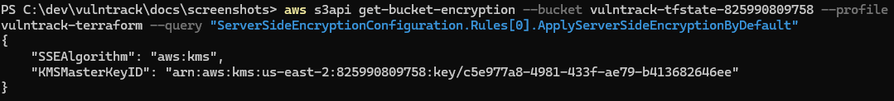

A second statement went in alongside it and had to come straight back out.
`DenyUnencryptedObjectUploads` required an
`x-amz-server-side-encryption: aws:kms` header on every `PutObject`. It
looks obviously correct for a secrets bucket. It locked Terraform out of
its own state on the very next write:

```
Error: Failed to save state
AccessDenied: ... not authorized to perform: s3:PutObject ... with an explicit deny in a resource-based policy
```

With bucket-default encryption configured, S3 encrypts server-side without
the client sending that header — so the condition denied the request before
the encryption it was checking for could happen. And because an explicit
`Deny` beats every `Allow`, no IAM change could have rescued it. Terraform
wrote the state it could not upload to `errored.tfstate`; the recovery was
to fix the policy out-of-band with the CLI and `terraform state push`.

### Web application firewall

Phase 5 already ran three AWS managed rule groups, which between them cover
XSS, SQL injection, and size limits on body, query string and cookie
header. Phase 7 added what they do not: a corrected rate limit, scanner
blocking, and a total-header-size cap.

| Rule | What it does |
|---|---|
| Rate limiting | 3000 requests per 5-minute window per source IP (WAF counts over a fixed 5-minute window, so a 600 req/min target is expressed as 3000) |
| `BlockScannerUserAgents` | Blocks ten known scanning tools by `User-Agent`, lowercased before matching |
| `BlockOversizedHeaders` | Blocks requests whose headers total more than 8 KB |

Managed Bot Control was considered and rejected: $10/month for behavioural
detection on an application with no real traffic, where a custom rule
demonstrates the mechanism and its limits more usefully.

Rules were then tested rather than assumed:

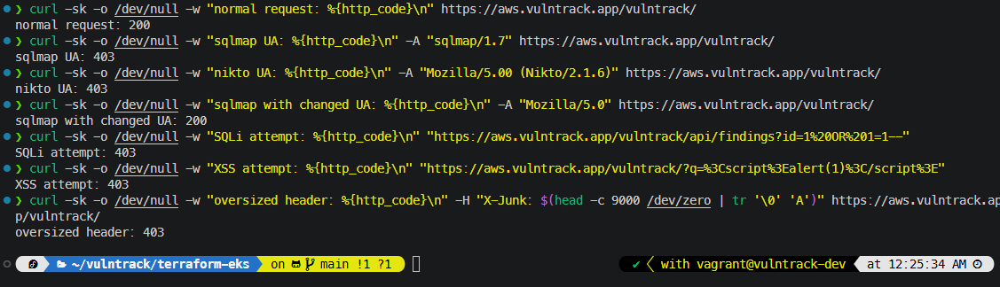

```
normal request:          200
sqlmap UA:               403   BlockScannerUserAgents
nikto UA:                403   BlockScannerUserAgents
same tool, generic UA:   200   bypassed
SQLi in query string:    403   AWSManagedRulesSQLiRuleSet
XSS in query string:     403   AWSManagedRulesCommonRuleSet
9 KB header:             403   BlockOversizedHeaders
```

The fourth line is deliberate. A `User-Agent` rule stops opportunistic
scanning and nothing else — one flag changes it, and the same tool walks
straight through. Knowing where a control stops is more useful than
claiming it is comprehensive.

### Scanning the vulnerability tracker for vulnerabilities

Scanning the image with Trivy returned **199 CRITICAL and HIGH findings**.
The breakdown explained itself immediately:

```
vulntrack-wildfly:latest (centos 7.9.2009): 112
Java: 87
```

The base image was **CentOS 7, end-of-life since 30 June 2024**. Those 112
findings were not a backlog to work through — they were permanent, with no
patches coming, growing with every new CVE. Among them `CVE-2021-43527`, a
five-year-old critical in NSS with a published fix that CentOS 7 will never
ship.

That reframed the work: not "fix some CVEs" but "replace a foundation that
cannot be fixed." Two changes:

- Base image `wildfly:31.0.1.Final-jdk17` → `wildfly:40.0.1.Final-jdk17`,
  which moves to **RHEL 9**, a supported distribution
- PostgreSQL JDBC driver 42.7.4 → 42.7.12, closing a SCRAM-SHA-256-PLUS
  downgrade issue (`CVE-2026-54291`) on the connection to RDS — both in
  `pom.xml` and in the WildFly module, since the module is what actually
  loads at runtime

| | Before | After |
|---|---|---|
| Base OS | CentOS 7.9 (EOL) | RHEL 9.8 (supported) |
| OS findings | 112 | 40 |
| Java findings | 87 | 20 |
| CRITICAL | 12 | **4** |
| HIGH | 187 | **56** |
| **Total** | **199** | **60** |

A 70% reduction, and the remaining OS findings now sit on a distribution
that still ships patches. The scan output is committed under
[`docs/security/`](docs/security/) so the claim is checkable.

What is left splits into two honest categories rather than one aspiration:

- **3 criticals with fixes WildFly 40 does not yet bundle** — `netty-handler`
  4.1.135 (fix in 4.1.137), `bcprov-jdk18on` 1.84 (fix in 1.85),
  `cxf-rt-transports-jms` 4.0.11 (fix in 4.1.7). Overriding jars inside a
  vendor's app server produces a combination nobody has tested; the correct
  action is to wait for the next WildFly release.
- **17 highs with no fix available at all** — accepted and recorded.

Nine major WildFly versions is a real jump — Hibernate moved 6.4 → 7.3 and
Weld 5.1 → 6.0 — so the upgrade was smoke- and sanity-tested locally before
going anywhere near the cluster:

```
ping:            200
dashboard:       200
register user:   201
login:           JWT issued
create asset:    201
read back:       correct JSON
```

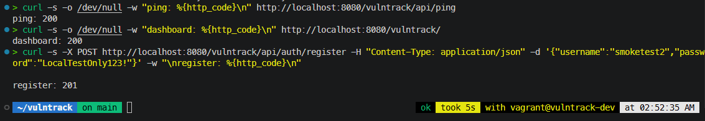

### Where the free tier ran out

Phase 5 noted that `t3.micro` gives 1 GB per node and that this "may be
tight once Istio sidecars are injected alongside WildFly." Phase 7 is where
that bill came due.

A `t3.micro` exposes roughly **520Mi of allocatable memory** after the
kubelet reservation. WildFly requested 384Mi and actually used ~403Mi, so
the kubelet evicted it — repeatedly, in a loop that produced hundreds of
dead pods over days. Three fixes in sequence:

- **Right-sized the request** to match measured usage. Understating what a
  container uses is what causes the scheduler to place it somewhere it does
  not fit.
- **Capped the JVM**, which by default sizes its heap from visible RAM and
  grows until something stops it. The first attempt set
  `MaxMetaspaceSize=128m` and produced a subtler failure: WildFly loads
  hundreds of modules, blew past it, and threw `OutOfMemoryError: Metaspace`
  while *appearing healthy* — the pod stayed `2/2 Running`, `/api/ping`
  returned 200, and every real request returned 500.
- **Added a priority class**, because everything in the cluster ran at
  priority 0 and the kubelet evicts the largest consumer. The application
  now outranks the controllers and the mesh, which can be rescheduled
  without an outage.

Then the WildFly 40 upgrade made the pod unschedulable outright:

```
0/5 nodes are available: 5 Insufficient memory.
3 node(s) had untolerated taint {node.kubernetes.io/memory-pressure}
```

Three of five nodes had been tainted by the kubelet as unable to accept
work. No request size fits a JVM application server plus an Envoy sidecar
into 520Mi. The node group moved to **three `t3.small` instances** — 2 GB
each, costing about the same as five micros — and the problem disappeared.

That is the honest finding: a service mesh and a Java application server do
not fit on free-tier nodes, and the failure mode is not a clean error but
months of intermittent instability that looks like an application bug.

### Host hardening: SELinux, auditd, and FIPS

SELinux was already `Enforcing` with the targeted policy — Fedora's default,
and worth verifying rather than assuming.

Audit logging was the opposite. `auditd` was active, rules loaded cleanly,
and `auditctl -l` listed all eighteen. Nothing was recorded. The cause is
shipped by the distribution: `/etc/audit/rules.d/audit.rules` contains

```
-D                 # delete all rules
-a task,never      # suppress syscall auditing for all tasks
```

with a header stating it exists "to negate the performance effects of the
audit system **by preventing syscall auditing to work**." Rules added
alongside it load without error and appear in `auditctl -l` — and record
nothing, because that file wipes the ruleset and disables syscall auditing
first. **A compliance check asking "is auditd enabled and are rules loaded?"
passes on a system that audits nothing.**

Renaming that file out of the way (`augenrules` only reads `*.rules`) and
loading [`vagrant/audit/vulntrack.rules`](vagrant/audit/vulntrack.rules)
produces actual records — identity file changes, privilege escalation,
infrastructure tooling execution, failed access attempts, and reads of the
AWS and Kubernetes credential directories:

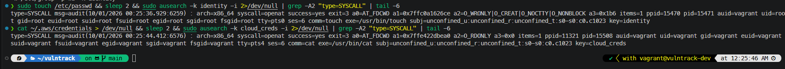
*`comm=cat exe=/usr/bin/cat auid=vagrant key=cloud_creds` — a concrete
answer to "how would you know if your credentials were read," and directly
relevant given an access key had to be rotated earlier in this phase*

FIPS was scoped rather than claimed, because FIPS compliance is a
certification covering every cryptographic module in a stack, not a switch.
What was implemented:

- **AWS API calls routed through FIPS endpoints** — `use_fips_endpoint`
  set on the profile, so Terraform and the CLI both resolve
  `kms-fips.us-east-2.amazonaws.com` rather than the standard endpoint
- **System-wide crypto policy set to FIPS**, restricting TLS cipher suites,
  SSH algorithms and certificate signatures — 61 TLS ciphers down to 40 on
  this image

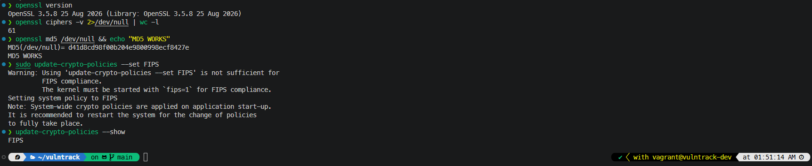
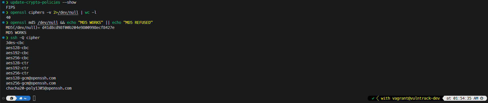
*Before and after `update-crypto-policies --set FIPS` — the cipher count drops
and the weak suites go, but note MD5 still runs: the system-wide policy governs
protocol-level algorithm selection, not direct hash calls. That needs the kernel
flag.*

The crypto policy change had an immediate practical consequence worth
recording: **SSH authentication with an Ed25519 key stopped working.**
Ed25519 is not a NIST-approved algorithm, so a FIPS-restricted client will
not offer it, and `git push` failed with `Permission denied (publickey)`
against a key that was correctly registered. Generating an RSA key — which
is approved — fixed it immediately. The modern default key type silently
becomes unusable under FIPS.

What was not implemented, and why:

- **Kernel `fips=1`** was attempted and reverted. Fedora 44 does not ship
  `fips-mode-setup` at all, and setting the boot parameter manually
  corrupted the GRUB configuration badly enough to require rebuilding the
  box. `update-crypto-policies` itself warns that the policy alone "is not
  sufficient for FIPS compliance."
- **FIPS-enabled EKS node AMIs** and a **FIPS-certified JVM crypto
  provider** — identified as the remaining layers, not implemented.
- Fedora is **not a FIPS-validated distribution** regardless. Red Hat
  validates RHEL; Fedora ships the same mechanisms without the
  certification.

So: FIPS mode demonstrated at two layers, with the remaining layers named.
Not "FIPS compliant."

---

## CI/CD pipeline

Every push to `main` triggers [`.github/workflows/deploy.yml`](.github/workflows/deploy.yml):

1. Builds the app with Maven
2. Authenticates to AWS via **OIDC** — no long-lived credentials stored in
   GitHub at all; the IAM role's trust policy is scoped to
   `repo:DevinCodes13/vulntrack` on the `main` branch specifically
3. Builds the Docker image and pushes it to ECR
4. Connects to the EKS cluster and performs a rolling restart, waiting for
   the rollout to finish before the workflow reports success

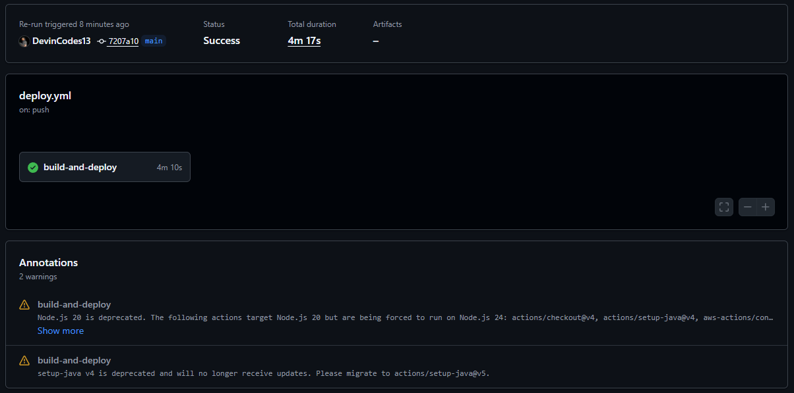

Getting the OIDC trust policy right took real debugging, most notably a
GitHub token format change that broke an exact-match trust policy
(diagnosed via CloudTrail, not guesswork):

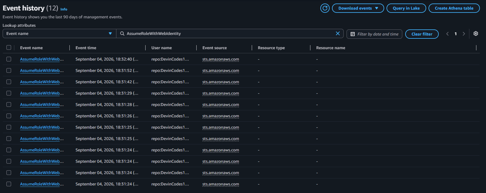
*Reading the actual `AssumeRoleWithWebIdentity` event to see exactly what
GitHub sent, rather than guessing from the generic "not authorized" error*

---

## Local development setup

### Recommended: the Vagrant dev box

A Fedora VM with the full toolchain — JDK 17, Maven, Docker, Terraform,
kubectl, Helm, AWS CLI — built unattended from
[`vagrant/`](vagrant/). Edit from VS Code on the host over Remote-SSH.
Full setup in [`vagrant/README.md`](vagrant/README.md).

```powershell
cd vagrant
vagrant plugin install vagrant-disksize
vagrant up
vagrant ssh-config --host vulntrack-dev | Out-File -Append -Encoding ascii "$env:USERPROFILE\.ssh\config"
```

Then connect VS Code to `vulntrack-dev`, clone the repo inside the box,
and follow the steps below from the integrated terminal.

### Alternative: directly on the host

#### Prerequisites

- JDK 17 (Eclipse Temurin recommended)
- Maven 3.9+
- Docker Desktop (with WSL2 backend on Windows)

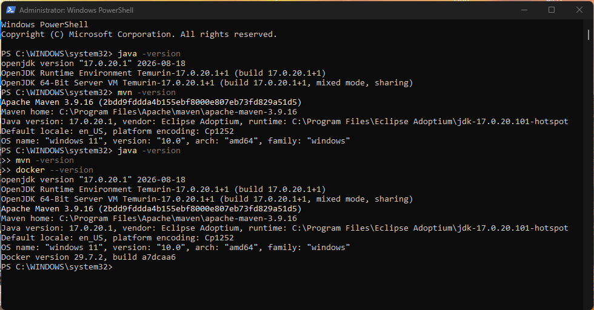
*Java, Maven, and Docker all verified in one terminal — after working
through several PATH/JAVA_HOME issues along the way*

#### First-time setup

```powershell
git clone https://github.com/DevinCodes13/vulntrack.git
cd vulntrack
mvn clean package
docker compose up -d --build
```

The app is available at `http://localhost:8080/vulntrack/` (dashboard) and
`http://localhost:8080/vulntrack/api` (REST API). The WildFly admin
console is at `http://localhost:9990`.

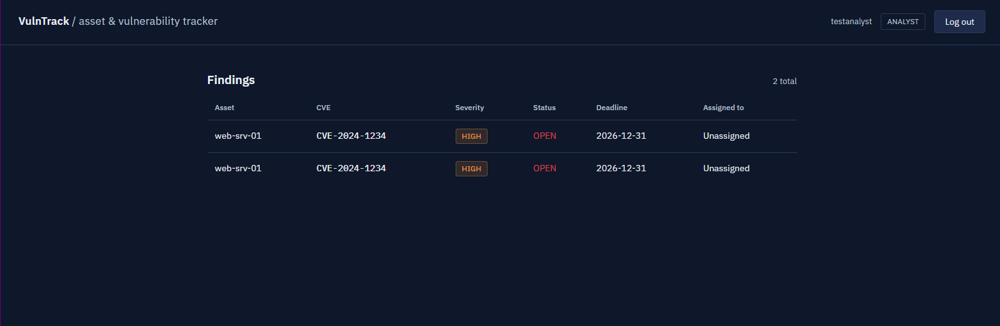

#### Rebuilding after code changes

```powershell
mvn clean package
docker compose down
docker compose up -d --build
```

---

## Troubleshooting log & lessons learned

Kept here rather than smoothed over, since debugging real infrastructure
issues is a meaningful part of what this project demonstrates.

### Phase 1–4

- **Maven archetype plugin failed outright** (`MissingProjectException`,
  instant failure, no clear cause) — scaffolded the project by hand
  instead of relying on `mvn archetype:generate`.
- **Adding a `NOT NULL` column via Hibernate's `hbm2ddl.auto=update`**
  failed against a table that already had rows with null values in that
  column. Resolved by clearing conflicting test data before redeploying —
  a real limitation of auto-migration, and part of why production systems
  use versioned migration tools (Flyway/Liquibase) instead.
- **JAX-RS `UriInfo.getPath()` leading-slash inconsistency** caused the
  auth filter's path-exclusion check to silently fail, blocking even the
  registration endpoint — fixed by checking both `"auth/"` and `"/auth/"`.
- **CDI-proxied JAX-RS resources cannot reliably inject
  `ContainerRequestContext`** — RESTEasy throws
  `RESTEASY003880: Unable to find contextual data`. Resolved with a
  `@RequestScoped` CDI bean (`RequestUserContext`) shared between the auth
  filter and the resource classes.
- **Notepad silently appends `.txt`** to filenames without a recognized
  extension (`Dockerfile` → `Dockerfile.txt`) unless the filename is
  quoted in the Save As dialog or "All Files" is selected explicitly.
- **WildFly's embedded-server CLI bootstrap can silently prevent real
  deployment.** Copying the WAR into `standalone/deployments/` *before*
  running the offline `datasource.cli` configuration step causes WildFly
  to auto-deploy it during that embedded boot and bake an "already
  deployed" marker into the image layer, so the real container never
  deploys the app at runtime, with no error logged anywhere. Fixed by
  sequencing the Dockerfile so the WAR is copied in only *after* the CLI
  step completes.
- **ALB health checks cannot carry authentication headers.** Once JWT auth
  was added, the load balancer's health check to `/api/ping` started
  failing with 401s. The health check endpoint has to be explicitly
  exempted from the auth filter — application security and infrastructure
  health monitoring are different concerns with different requirements.
- **A prior project's hardened IAM policy blocked this one.** Reusing an
  IAM user from an earlier AWS hardening project for Terraform failed
  because its policy has an explicit `Deny` on security-group rule
  changes — which always overrides any `Allow`, even from a different
  attached policy. Resolved by creating a separate, purpose-scoped IAM
  user rather than loosening a different project's intentionally hardened
  policy.
- **GitHub's OIDC token `sub` claim format changed** to include immutable
  numeric owner/repo IDs rather than plain names, breaking an exact-match
  IAM trust policy written against the older format. Diagnosed via
  CloudTrail's `AssumeRoleWithWebIdentity` event history rather than
  guessing from the generic "not authorized" error. Resolved with a
  `StringLike` wildcard pattern that tolerates both formats.
- **A region placeholder in an IAM policy resource ARN went uncorrected**
  (`us-east-1` instead of the actual `us-east-2`), causing the GitHub
  Actions role to authenticate successfully via OIDC but still be denied
  `ecr:InitiateLayerUpload` — a reminder that region-scoped ARNs in policy
  templates need to be checked against the actual deployment region.
- **`docker login --password-stdin` failed with a 400 Bad Request** via
  PowerShell piping, despite valid credentials (confirmed by testing with
  `--password` directly instead) — a transport/encoding quirk specific to
  that Docker Desktop/PowerShell combination, not a credentials problem.
- **Destroying and recreating Secrets Manager entries hits AWS's default
  30-day recovery window** — a `terraform destroy` schedules secrets for
  deletion rather than purging them immediately. Setting
  `recovery_window_in_days = 0` makes destroy/recreate cycles clean.
- **IAM least-privilege is iterative, not perfect on the first try.**
  Building each Terraform IAM policy surfaced a long tail of missing
  read-back permissions that only appear once Terraform actually tries to
  read a resource back into state after creating it. Rather than chase
  each one individually, AWS's managed `ReadOnlyAccess` policy was layered
  on top of the narrower custom policy.

### Phase 5

- **Cloudflare Registrar contractually forbids changing nameservers.**
  Discovered after registering `vulntrack.app` there specifically for the
  Route53 integration — Cloudflare's terms require using their own
  nameservers, and newly-registered domains carry a mandatory 60-day
  ICANN transfer lock regardless of registrar. Resolved by delegating a
  subdomain (`aws.vulntrack.app`) to Route53 via an `NS` record, rather
  than waiting out the lock or switching registrars.
- **AWS account "Free Tier" flags restrict more than just billing.**
  Beyond blocking Route53 domain registration outright, the same flag
  blocked launching non-free-tier EC2 instance types (`t3.medium` failed
  with "not eligible for Free Tier"), forcing the entire EKS node group
  onto `t3.micro` — which then drove several of the harder problems below.
- **EKS managed node groups cap pod density by instance networking
  capacity, not CPU/memory.** `t3.micro` supports only 4 pod IPs per node
  — a ceiling completely invisible in `kubectl top` or resource
  dashboards, only surfacing as `FailedScheduling: ... Too many pods`.
  Fixed properly (not just by adding nodes indefinitely) by enabling VPC
  CNI prefix delegation and a custom launch template overriding kubelet's
  `maxPods`, raising the real per-node ceiling to 30.
- **A custom EKS node-group launch template requires IAM permissions no
  standard node group ever needs**: `ec2:CreateLaunchTemplate`, and
  separately `ec2:RunInstances` — EKS validates that the *calling IAM
  principal* (not just its own service role) could launch an instance
  with that template, before delegating the actual launch internally.
  Neither permission had ever been needed before this specific change.
- **A `terraform apply` that reported success wasn't actually
  succeeding.** Two consecutive "Apply complete!" results were followed
  by the created resources vanishing entirely from both Terraform state
  and AWS's own API. Root-caused by reading a *complete*, unedited log
  rather than a summarized one: an explicit `Error: creating EKS Node
  Group ... CREATE_FAILED` block had been present in the output the whole
  time. Terraform's own provider automatically rolls back (deletes) a
  node group that fails its post-creation health check — which looked
  identical to a mysterious external process deleting things, until the
  actual error text was read directly. The underlying cause was a
  malformed `nodeadm` YAML config, produced by Terraform heredoc
  indentation stripping not behaving as expected; rewritten using
  explicit zero-indentation string concatenation instead.
- **Istio's default control-plane and gateway resource requests assume
  real infrastructure**, not a single `t3.micro`. `istiod`'s default 2Gi
  memory request exceeds an entire node's total RAM — not fixable by
  adding more nodes, since a pod's request has to fit on *one* node.
  Resolved by explicitly overriding `istiod` and the gateway's resource
  requests to fit, with the tradeoff clearly documented rather than
  silently normalized.
- **ExternalDNS silently generates zero DNS records with no error**, if
  its `sources` config doesn't explicitly include `ingress` (the Helm
  chart's default doesn't) — and separately, if the target `Ingress`
  relies on the deprecated `kubernetes.io/ingress.class` annotation
  instead of `spec.ingressClassName`. Both symptoms look identical
  ("All records are already up to date," forever) and were only
  distinguished by turning on debug-level logging and reading the literal
  per-resource skip reason (`"No endpoints could be generated from
  ingress/default/vulntrack"`) rather than guessing from the calm,
  error-free info-level logs.
- **A Terraform plan that looked like a routine config update would have
  destroyed the entire EKS cluster.** Adding an `access_config` block to
  enable EKS access entries, without also specifying the create-time-only
  `bootstrap_cluster_creator_admin_permissions` attribute, made Terraform
  treat that value as changing — which forces full cluster replacement
  (cascading into the OIDC provider and every IRSA trust policy that
  references it). Caught by reading the complete plan output before
  applying and specifically checking for `must be replaced` versus
  `will be updated in-place`, rather than trusting a plan summary line.
- **AWS-level IAM permissions and in-cluster Kubernetes RBAC are two
  entirely separate authorization systems.** Granting the GitHub Actions
  IAM role `eks:DescribeCluster` was necessary but not sufficient for the
  CI/CD pipeline to actually run `kubectl` commands against the cluster —
  it also needed an explicit **EKS access entry** mapping that IAM
  principal to real Kubernetes RBAC permissions, since IAM permissions
  alone grant no visibility or control inside the cluster itself.

### Phase 6

- **An empty state file isn't necessarily a lost one.** The local
  `terraform.tfstate` was 183 bytes with zero resources; the `.backup`
  beside it held 44. Rather than assume the worst, the serial numbers
  were compared (95 in the backup, 143 live — 48 writes, consistent with
  a destroy that ran to completion), and then AWS was queried directly
  for every resource type the backup listed. Nothing orphaned. The fix
  for the underlying risk was a versioned S3 backend, not better luck.
- **Terraform backend blocks can't use variables — and the failure
  doesn't say so.** The AWS provider authenticated through
  `var.aws_profile` correctly, but the S3 backend silently fell back to
  the `default` profile: a different, far less privileged IAM user. The
  error was a bare `403 Forbidden` on `HeadObject`, while the same call
  run by hand with the right profile returned a correct `404`. Only
  `TF_LOG=DEBUG` named the actual principal making the request. Fixed
  with a literal `profile` in `backend.tf`.
- **A hardcoded reference to something Kubernetes creates is a rebuild
  waiting to fail.** The WAF association's `alb_arn` default pointed at
  an ALB the Load Balancer Controller had deleted along with the old
  Ingress. Moved to the `alb.ingress.kubernetes.io/wafv2-acl-arn`
  annotation, which re-attaches the Web ACL whenever the controller
  recreates the ALB.
- **`$Latest` in a launch template produces a permanent diff.** AWS
  resolves and stores the version number; Terraform keeps comparing the
  literal string. Every plan proposed the same change, and every apply
  "fixed" it. `latest_version` resolves on the Terraform side instead.
- **A node's advertised pod capacity and its real capacity can
  disagree.** Phase 5's `maxPods: 30` came back with the launch template,
  so `kubectl` reported 30 allocatable pods per node. Prefix delegation —
  the part that actually supplies the IP addresses — had been applied
  with `kubectl set env` and wasn't in code. The result looked like an
  unrelated cert-manager failure (a Helm `startupapicheck` timeout) until
  the pod's events showed `failed to assign an IP address to container`.
- **An Ingress backend can't cross namespaces, and the ALB still gets
  built.** With the Istio gateway installed in `istio-system` and the
  Ingress in `default`, the Load Balancer Controller created the ALB,
  both listeners, the certificate binding, and the WAF association — then
  a listener rule returning a fixed `503 Backend service does not exist`,
  because it had no Service to build a target group from.
  `kubectl describe ingress` showed it directly:
  `services "istio-ingressgateway" not found`. The deeper cause: Phase 5
  committed the Helm *values* files but never the install commands, so
  the namespace was never written down. The
  [rebuild runbook](#rebuild-runbook) fixes that.
- **Health-checking an app path through a proxy tests the wrong thing.**
  Once the target group existed, it was `unhealthy` with
  `ResponseCodeMismatch` — the ALB was probing `/vulntrack/api/ping` on
  the gateway pod. Pointed it at the gateway's own readiness endpoint
  (`15021`, `/healthz/ready`) instead; end-to-end reachability is a
  separate check.
- **ExternalDNS "All records are already up to date" has a third
  meaning.** Phase 5 hit it twice with two different causes; Phase 6
  found another. With `--registry=txt` configured correctly, ExternalDNS
  still wrote no TXT ownership records for the zone-apex name — its
  change sets contained only A and AAAA — and it then refused to update
  or delete those records because it couldn't prove it owned them
  (`missing owner label` at debug level). CloudTrail confirmed ExternalDNS
  itself had created them. Setting `txtPrefix: "extdns-%{record_type}."`
  placed the registry records at `extdns-a` / `extdns-aaaa` inside the
  zone, after which ownership worked. This had been silently broken since
  Phase 5 — and explains why the Phase 5 teardown needed Route53 records
  deleted by hand.
- **Fedora 44 dropped JDK 17, and Maven depends on JDK 25.** The build
  succeeded anyway thanks to `<release>17</release>`, but the runtime is
  a JDK 17 WildFly image. Temurin 17 installed cleanly and still lost the
  default, because Fedora sets `alternatives` priority from the version
  string (25000421). Pinned with `alternatives --set`.

### Phase 7

- **A KMS key being enabled and a service being able to use it are
  different things.** Attaching the customer-managed key to the node
  group's launch template failed with
  `Client.InvalidKMSKey.InvalidState` — a message that reads like the key
  is broken. It was enabled and healthy. A KMS key carries its own
  resource policy separate from IAM, and both must allow an action; the
  default policy names only the account root, so the Auto Scaling
  service-linked role could not use it and no IAM grant would have helped.
- **Least privilege is visible when it bites.** Three separate operations
  in this phase stopped on permission denials — `kms:TagResource` when
  creating the key, `rds:CreateDBSnapshot` when starting the database
  migration, `s3:PutBucketPolicy` when hardening the state bucket. None
  were needed to build the original stack. Each one was a deliberate grant
  rather than a wildcard already in place, which is the point.
- **An explicit `Deny` beats every `Allow`, including your own.** A bucket
  policy statement requiring `x-amz-server-side-encryption: aws:kms` on
  every `PutObject` locked Terraform out of its own state file on the next
  write. With bucket-default encryption set, S3 encrypts server-side
  without the client sending that header, so the condition denied the
  request before the encryption it checked for could occur. Terraform
  wrote the unsaved state to `errored.tfstate`; recovery was to fix the
  policy with the CLI and `terraform state push`.
- **"No changes" is sometimes the dangerous answer.** After migrating RDS
  to an encrypted instance, `terraform plan` reported no differences —
  because it was still tracking the *old* instance, which still existed
  and still matched the configuration. Deleting that instance would have
  left Terraform ready to recreate it: a fresh, empty, unencrypted
  database, while the real one sat unmanaged. `state rm` plus `import`
  reconciled it.
- **A container can be `Running` and `2/2` and serve 500s on every real
  request.** Capping `MaxMetaspaceSize` at 128m was too small for WildFly's
  module count. The JVM threw `OutOfMemoryError: Metaspace` while loading
  classes, but never exited — so the pod stayed healthy by every signal
  Kubernetes checks. The readiness probe pointed at `/api/ping`, which
  touches nothing, and returned 200 throughout. A probe that exercises the
  database would have caught it.
- **Understating a container's memory request causes the eviction, not the
  limit.** The app requested 384Mi and used ~403Mi, so the scheduler placed
  it on nodes where it did not fit and the kubelet evicted it — for days,
  producing hundreds of dead pods. Raising the request to measured usage
  and adding a priority class (everything ran at priority 0, so the kubelet
  always picked the largest consumer) fixed the loop; moving to `t3.small`
  fixed the underlying ceiling.
- **The distribution shipped audit logging configured not to audit.**
  `/etc/audit/rules.d/audit.rules` on Fedora contains `-D` followed by
  `-a task,never`, with a header stating it exists "to negate the
  performance effects of the audit system by preventing syscall auditing
  to work." Custom rules load without error, appear in `auditctl -l`, and
  record nothing. A check for "auditd enabled with rules loaded" passes on
  a system that audits nothing.
- **FIPS mode breaks Ed25519 SSH keys.** Ed25519 is not NIST-approved, so
  with the FIPS crypto policy enabled the client will not offer it —
  `git push` failed with `Permission denied (publickey)` against a key
  that was correctly registered on the remote. An RSA key worked
  immediately. Enabling a compliance control silently disabled the modern
  default key type.
- **Take a snapshot before touching a bootloader.** Adding `fips=1` via
  `grubby` wrote a malformed `boot=UUID=` parameter into the kernel line,
  and the VM dropped to a GRUB syntax error on every boot. It was
  recoverable by editing the boot line from the GRUB menu, but the box was
  rebuilt instead. `vagrant snapshot save` takes seconds and would have made
  it a one-command rollback.
- **Two clones of the same repo drift, and `vagrant up` reads only one of
  them.** The Windows clone sat seven commits behind while all the work
  happened in the VM's clone. The rebuilt box therefore provisioned from a
  week-old `provision.sh` with no audit rules — and the step that should
  have installed them was guarded by `|| true`, so provisioning reported
  success while silently doing nothing. Defensive error suppression hid
  exactly the failure it was added to tolerate.

---

## Roadmap

- [x] Phase 1 — Maven/Jakarta EE scaffold, WildFly deployment, first REST endpoint
- [x] Phase 2 — PostgreSQL integration via custom WildFly datasource module
- [x] Phase 3 — JPA entity model, full CRUD REST API
- [x] Phase 3.5 — JWT authentication, bcrypt password hashing, role-based access control
- [x] Phase 4 — Infrastructure as code (Terraform), OIDC-based GitHub Actions CI/CD pipeline, minimal frontend dashboard, verified live end-to-end on AWS (ECS/Fargate)
- [x] Phase 5 — Re-architected onto EKS: Route53 + ExternalDNS, Let's Encrypt via cert-manager (bridged into ACM), AWS WAF, and a full Istio service mesh with STRICT mutual TLS between pods. CI/CD pipeline re-pointed from ECS to EKS with proper Kubernetes RBAC access.
- [x] Phase 6 — Reproducible Vagrant/Fedora dev environment; Terraform state migrated to a versioned S3 backend; full destroy-and-rebuild of the EKS stack from an empty state file, with nine rebuild-only defects found and fixed and a written rebuild runbook
- [x] Phase 7 — Security hardening: customer-managed KMS key with rotation, EBS and RDS encryption (snapshot/copy/restore migration), state bucket hardened, WAF rate limiting and scanner blocking verified by request, container base image moved off EOL CentOS 7 to RHEL 9 cutting CRITICAL/HIGH findings from 199 to 60, nodes right-sized off the free tier, SELinux and auditd verified, FIPS scoped at the AWS and OS crypto-policy layers
- [ ] Monitor certificate expiry — cert-manager renews at 30 days remaining, but nothing alerts if it fails silently, and Let's Encrypt ended its expiration notification email service in June 2025. A check against the live endpoint (not a calendar reminder) is the right control.
- [ ] Phase 8 — Dynamic application security testing: scan the running application with OWASP ZAP against the local stack, triage what the WAF catches versus what reaches the app, and fix what the tracker finds in itself
- [ ] Next — VPC CNI prefix delegation in Terraform (currently a manual `kubectl` step), Helm installs scripted rather than documented, `terraform-ecs/` moved to the S3 backend, automated Let's Encrypt → ACM renewal (currently a manual bridge), External Secrets Operator instead of manually-synced Kubernetes Secrets, tighter IAM scoping on the remaining broad grants

---

## Author

Devin Phillips — [github.com/DevinCodes13](https://github.com/DevinCodes13)
