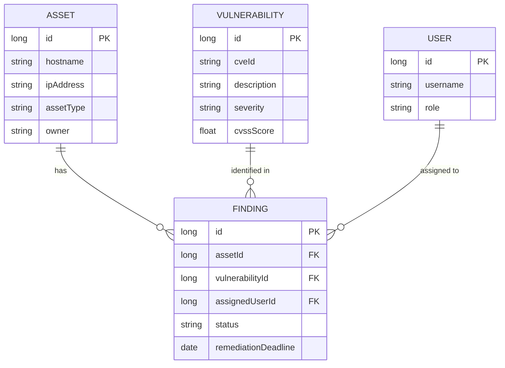

# VulnTrack — entity relationship diagram

Core data model: an `Asset` can have many `Finding`s, each linking a specific
`Vulnerability` to that asset, optionally assigned to a `User` for remediation.

## Notes

- `Finding.assignedUserId` is nullable — a finding can exist before anyone is
  assigned to remediate it. Enforced at the JPA level (`@ManyToOne` without
  `optional = false`), not at the database schema level.
- The `USER` entity is implemented as `AppUser` in code (`AppUser.java`),
  since `USER` is a reserved word in some SQL dialects and breaks table
  creation if used literally.
